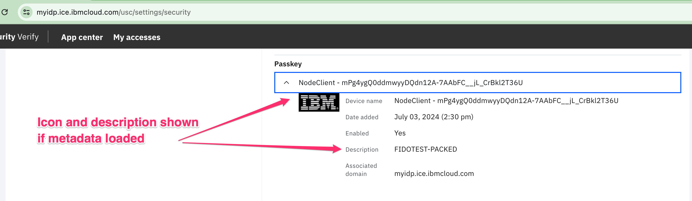

# FIDO2 NodeJS Clients

This repository contains command-line NodeJS clients for exercising FIDO2 registration and login flows for both IBM Security Verify Access (ISVA), and IBM Security Verify (ISV).

## Getting started

Follow the steps in this section for one-time setup of your client.

### Establishing FIDO Attestation artifacts

The first step to using the assets in this repository is to generate yourself a set of attestation keys for the various attestation types supported by the client. A script is provided that run on MacOS and Linux.

After cloning the repository change into the `certs` directory and run the `./generate_attestation_certs.sh` script. An example is shown here:
```
[certs] $ ./generate_attestation_certs.sh 
Creating packed attestation aaguid: packed.aaguid
Creating self attestation aaguid: self.aaguid
Creating Root CA key: rootCA.key
Creating Root CA certificate: rootCA.pem
Creating U2F key: u2f.key
Creating U2F CSR: u2f.csr
Creating U2F certificate: u2f.pem
Certificate request self-signature ok
subject=C=US, O=IBM, CN=U2F-SIGNER
Creating packed key: packed.key
Creating packed CSR: packed.csr
Creating packed certificate: packed.pem
Certificate request self-signature ok
subject=C=US, O=IBM, OU=Authenticator Attestation, CN=PACKED-SIGNER
Generating U2F metadata file: fidotest-u2f.json
Generating PACKED metadata file: fidotest-packed.json
Generating SELF metadata file: fidotest-self.json
Generating encryption passphrase file: encpass.txt
FIDO2_CLIENT_CONFIG={"encryptionPassphrase":"bf89745ba1bd3d78b97e5426e85ce8d105d748c8","fido-u2f":{"privateKeyHex":"78ba95984cca9b81f2388c103cc2f25c51dbcf6183083b57afb963fc6329cda9","publicKeyHex":"04da2be369515411beea479b0f4a51ec13f6ec2332a8dca69fa82a75ba5dc3dbd4fdf1cf48ce6d9dd18e7b610b7a098c91a30f3f14d30b3c20f032287f526c9246","cert":"MIIBpDCCAUqgAwIBAgIUcTVBA0VpCRNXHTNyGvHo2vE1+5wwCgYIKoZIzj0EAwIwLjELMAkGA1UEBhMCVVMxDDAKBgNVBAoMA0lCTTERMA8GA1UEAwwIRklET1RFU1QwIBcNMjQwODIzMjEzNDMwWhgPMjA1MjAxMDgyMTM0MzBaMDAxCzAJBgNVBAYTAlVTMQwwCgYDVQQKDANJQk0xEzARBgNVBAMMClUyRi1TSUdORVIwWTATBgcqhkjOPQIBBggqhkjOPQMBBwNCAATaK+NpUVQRvupHmw9KUewT9uwjMqjcpp+oKnW6XcPb1P3xz0jObZ3RjnthC3oJjJGjDz8U0ws8IPAyKH9SbJJGo0IwQDAdBgNVHQ4EFgQUBf4iO8In/jIB1J4ymVqTFCI0mjgwHwYDVR0jBBgwFoAU9tCfQAPGCUMCrCJn4WIoDa4tH6MwCgYIKoZIzj0EAwIDSAAwRQIhAMM1Y7OQx5l9rC4xyYCnM0KifS0w2YtPpw8WuP1UNPaEAiBpo87tgMGuXjzEjNfIwKe8Als0fKQNAqThm5tCZhlg6A=="},"packed":{"aaguid":"9c512bfc-f2ee-4c02-a1f1-cee67250d888","privateKeyHex":"08c95ac6867bfe0515bdd85340a4a55938a9b2eb0689a4e54d3c4fc4b5b4c011","publicKeyHex":"04d0d40583508033eb76c72da00ebbbced04f49bfc8712037018fb8c0a51013bc5db6aeca205f3eab030ffb186712eb092f21eb9e75cd70e390fa95e7cd6a54e1a","cert":"MIIB/DCCAaKgAwIBAgIUcTVBA0VpCRNXHTNyGvHo2vE1+50wCgYIKoZIzj0EAwIwLjELMAkGA1UEBhMCVVMxDDAKBgNVBAoMA0lCTTERMA8GA1UEAwwIRklET1RFU1QwIBcNMjQwODIzMjEzNDMwWhgPMjA1MjAxMDgyMTM0MzBaMFcxCzAJBgNVBAYTAlVTMQwwCgYDVQQKDANJQk0xIjAgBgNVBAsMGUF1dGhlbnRpY2F0b3IgQXR0ZXN0YXRpb24xFjAUBgNVBAMMDVBBQ0tFRC1TSUdORVIwWTATBgcqhkjOPQIBBggqhkjOPQMBBwNCAATQ1AWDUIAz63bHLaAOu7ztBPSb/IcSA3AY+4wKUQE7xdtq7KIF8+qwMP+xhnEusJLyHrnnXNcOOQ+pXnzWpU4ao3MwcTAMBgNVHRMBAf8EAjAAMCEGCysGAQQBguUcAQEEBBIEEJxRK/zy7kwCofHO5nJQ2IgwHQYDVR0OBBYEFFY56HWDdb58S58nHrPJ4e02KsRyMB8GA1UdIwQYMBaAFPbQn0ADxglDAqwiZ+FiKA2uLR+jMAoGCCqGSM49BAMCA0gAMEUCIAdgde2OgVR61Grtcg+KBEtBi35kRyPSmoOFPybHaZ8YAiEArl+Pci7JxTRmnS/XnzUauMFlKwIbGgjNnyhyOiCOQLo="},"packed-self":{"aaguid":"7dc85b70-7f8a-4b69-b751-29b32b643177"}}
```

This script produces three JSON FIDO Metadata files (in MDS3 format), which can be loaded onto your FIDO2 server (either an ISV tenant, or your ISVA server):

 - `fidotest-u2f.json`
 - `fidotest-packed.json`
 - `fidotest-self.json`

The script also generates a configuration variable called `FIDO2_CLIENT_CONFIG` which will be used in the next step.

Note: There is also a Node.JS equivalent of the bash script provided called `generate_attestation_certs.js`. This should be functionally equivalent to `generate_attestation_certs.sh` except that it doesn't generate unnecessary CSR files, nor does it require some of the input files used by the openssl command line utility. You can use it as an alternative to `generate_attestation_certs.sh` simply by using Node.JS on the command line:

```
[certs] $ node generate_attestation_certs.js
<equivalent output as above>
```

Both the bash script and the Node.JS script are idemptotent - you can run them multiple times and they will only regenerate artifacts that do not already exist.


### Creating the .env file

Change back to the top-level directory of the repository code, and copy the `.env.example` file to a new file `.env`

The `.env` file will need to be populated with configuration data for either your ISV tenant or ISVA server. The instructions in this readme are going to focus on configuration for **ISV (SaaS)**, as each ISVA environment can be a little different. The ISVA configuration has been tested against a demonstration site that I manange (https://fidointerop.securitypoc.com) and provided it is up and running you are welcome to try running the client against that site as well. Follow the instructions in the `.env.example` file for how to setup the client against `fidointerop.securitypoc.com`.

#### Updating .env for your ISV Tenant

Edit the `.env` file and update the values of `ISV_TENANT_ENDPOINT`, `RPID` and `ORIGIN` to match your tenant.

Set the value of the `FIDO2_CLIENT_CONFIG` in the `.env` file to the value produced in the output of the `generate_attestation_certs.sh` script run during th previous step.


Pick an ISV username (you can look for your own username by checking the `AZN_CRED_PRINCIPAL_NAME` in the https://YOUR_TENANT/ivcreds credential viewer) and set the username value in the variable `ISV_USERNAME`.

Login to your tenant as an administrator, navigate to the admin UI, then `Security -> API Access` and create an OAuth API client with at least the following entitlements:
 - Read users and groups (`readUserGroups`)
 - Manage second-factor authentication enrollment for all users (`manageEnrollMFAMethodAnyUser`)
 - Authenticate any user (`authnAnyUser`)

Gather the OAuth client ID and secret, and put their values in the `.env` files for the variables `OAUTH_CLIENT_ID` and `OAUTH_CLIENT_SECRET` respectively. If you have an `OAUTH_CLIENT_ID` and `OAUTH_CLIENT_SECRET` then you do not need the `OIDC_USER_ACCESS_TOKEN` variable and can leave it commented out.

If you don't have administrative access to the tenant you are working with, but do have a normal user account and can login to the tenant, then there is still a way to exercise the client. Visit the security settings page of your user profile (https://YOUR_TENANT/usc/settings/security) with the network debugger in your browser open, and look for any of the XHR requests (eg. the one for `registrations`), and extract the value of the OAuth access token from the `Authorization` Request Header (the part AFTER `Bearer `). You can set this value in the `.env` file variable `OIDC_USER_ACCESS_TOKEN` and comment out the `OAUTH_CLIENT_ID` and `OAUTH_CLIENT_SECRET` entries. In this case you **MUST** set the `ISV_USERNAME` value to your own username. Note that using this technique, you will need to occassionally get a new access token and update it in `.env` since they will expire with your browser session.


## Installing required node packages

In testing, I was using node v21.7.2, though anything "current" should work. From the top-level directory of the repository, install required node packages with `npm install`. Example:

```
[fido2-node-clients] $ npm install

added 5 packages, and audited 6 packages in 468ms

2 packages are looking for funding
  run `npm fund` for details

found 0 vulnerabilities
```

## Running the first example

Provided you have followed the configuration instructions above, you should now be ready to run the first example program, which creates a FIDO2 registration against your account, and then immediately also performs an assertion flow.

Run the example as shown (note that I have reformatted the output to pretty-print the JSON strings and added some blank lines for readability):
```
[fido2-node-clients] $ node isv_example1.js 

Performing attestation and assertion for format: packed
2024-08-23T22:05:18.914Z performAttestation sending attestation options to ISV:
{
  "userId": "50BCRQVNC0",
  "authenticatorSelection": {
    "userVerification": "required",
    "requireResidentKey": true
  }
}

2024-08-23T22:05:19.499Z performAttestation sending attestation result to ISV:
{
  "id": "U2FsdGVkX19bg8bmysGHt3vpWdfg1DGG0zeQnaSpI38AmoxgjSFjB_Wr2KVcWPmzJCZjj7yGw5FfObyR3V43fGU1TYkwoK7bnS2GJ-h0PDFmS4pFH3bI66RYl1oesq8M",
  "rawId": "U2FsdGVkX19bg8bmysGHt3vpWdfg1DGG0zeQnaSpI38AmoxgjSFjB_Wr2KVcWPmzJCZjj7yGw5FfObyR3V43fGU1TYkwoK7bnS2GJ-h0PDFmS4pFH3bI66RYl1oesq8M",
  "response": {
    "clientDataJSON": "eyJvcmlnaW4iOiJodHRwczovL215aWRwLmljZS5pYm1jbG91ZC5jb20iLCJjaGFsbGVuZ2UiOiJpUDR6d2R4VzE4SGhGa19tek12eTRod0FOZGNGWkpkenJJQzdtR09hU0ZnIiwidHlwZSI6IndlYmF1dGhuLmNyZWF0ZSJ9",
    "attestationObject": "o2NmbXRmcGFja2VkZ2F0dFN0bXSjY2FsZyZjeDVjgVkCADCCAfwwggGioAMCAQICFHE1QQNFaQkTVx0zchrx6NrxNfudMAoGCCqGSM49BAMCMC4xCzAJBgNVBAYTAlVTMQwwCgYDVQQKDANJQk0xETAPBgNVBAMMCEZJRE9URVNUMCAXDTI0MDgyMzIxMzQzMFoYDzIwNTIwMTA4MjEzNDMwWjBXMQswCQYDVQQGEwJVUzEMMAoGA1UECgwDSUJNMSIwIAYDVQQLDBlBdXRoZW50aWNhdG9yIEF0dGVzdGF0aW9uMRYwFAYDVQQDDA1QQUNLRUQtU0lHTkVSMFkwEwYHKoZIzj0CAQYIKoZIzj0DAQcDQgAE0NQFg1CAM-t2xy2gDru87QT0m_yHEgNwGPuMClEBO8XbauyiBfPqsDD_sYZxLrCS8h6551zXDjkPqV581qVOGqNzMHEwDAYDVR0TAQH_BAIwADAhBgsrBgEEAYLlHAEBBAQSBBCcUSv88u5MAqHxzuZyUNiIMB0GA1UdDgQWBBRWOeh1g3W-fEufJx6zyeHtNirEcjAfBgNVHSMEGDAWgBT20J9AA8YJQwKsImfhYigNri0fozAKBggqhkjOPQQDAgNIADBFAiAHYHXtjoFUetRq7XIPigRLQYt-ZEcj0pqDhT8mx2mfGAIhAK5fj3IuycU0Zp0v1581GrjBZSsCGxoIzZ8ocjogjkC6Y3NpZ1hIMEYCIQDpO4Q-NU5oyqwomtEKJU4uV8x7h7-6uNIrapuVGuna-wIhAIQP82SBDIZ7i66bz0tp9J1EUYTZ4UuQshjOyFbFbNfjaGF1dGhEYXRhWOTeeeHNF-cYKzCL-KhAGuxFX5RrGUWa1yrUSWIMt1-bPEUAAAAAnFEr_PLuTAKh8c7mclDYiABgU2FsdGVkX19bg8bmysGHt3vpWdfg1DGG0zeQnaSpI38AmoxgjSFjB_Wr2KVcWPmzJCZjj7yGw5FfObyR3V43fGU1TYkwoK7bnS2GJ-h0PDFmS4pFH3bI66RYl1oesq8MpQECAyYgASFYIGju5aPVP83TSlEtqxdhd7NQkYqyVr6z4ByKEPMKihHRIlgg2fWiE2GbeyvAdIFWkZiIGQ6pVF-2l_9kF9eTKI5TySI"
  },
  "type": "public-key",
  "getClientExtensionResults": {},
  "nickname": "NodeClient - iP4zwdxW18HhFk_mzMvy4hwANdcFZJdzrIC7mGOaSFg",
  "enabled": true,
  "getTransports": [
    "node"
  ]
}

2024-08-23T22:05:20.024Z performAttestation got attestationResultResponse:
{
  "id": "e87b398b-890c-4ccd-895e-93eddb3ad72a",
  "userId": "50BCRQVNC0",
  "type": "fido2",
  "created": "2024-08-23T22:05:19.890Z",
  "updated": "2024-08-23T22:05:19.890Z",
  "enabled": true,
  "validated": true,
  "attributes": {
    "attestationType": "Basic",
    "attestationFormat": "packed",
    "nickname": "NodeClient - iP4zwdxW18HhFk_mzMvy4hwANdcFZJdzrIC7mGOaSFg",
    "userVerified": true,
    "userPresent": true,
    "credentialId": "U2FsdGVkX19bg8bmysGHt3vpWdfg1DGG0zeQnaSpI38AmoxgjSFjB_Wr2KVcWPmzJCZjj7yGw5FfObyR3V43fGU1TYkwoK7bnS2GJ-h0PDFmS4pFH3bI66RYl1oesq8M",
    "credentialPublicKey": "v2EzYi03Yi0xAWItMlggaO7lo9U/zdNKUS2rF2F3s1CRirJWvrPgHIoQ8wqKEdFhMQJhMyZiLTNYINn1ohNhm3srwHSBVpGYiBkOqVRftpf/ZBfXkyiOU8ki/w==",
    "rpId": "myidp.ice.ibmcloud.com",
    "counter": 0,
    "aaGuid": "9C512BFC-F2EE-4C02-A1F1-CEE67250D888",
    "icon": "data:image/png;base64,iVBORw0KGgoAAAANSUhEUgAAAJUAAABGCAIAAABKakGZAAAAAXNSR0IArs4c6QAAAAlwSFlzAAAWJQAAFiUBSVIk8AAAIA1JREFUeAHtnAm0VNWVhmt4E5MIOIJI8CFgEGS0VdohjdiJHTMZgiYIWaKd1clSI23a1QaTNoYkqzuuLLsTO1EXSYwGNLbaYBtxROAxKIMMAYSHEZkNyvwevMer6m/vfe+pW7fq3qp6YDqu5vC4de45e/97n73PsM+5tyqROJFOWOCEBU5Y4IQFTljg/58Fkn+xTU4mPd2y2WxRJY0gqrYoS0WFHzZ+RcpEEaeiKk6UfyQsUPWR0DJWydAUUnywxiJ8hCsj/Vdy+go12tGHyt38FiIoLLcSR+YIQoAFtyH/UV/ahU6KUOfPz64qVF4gt50Fxxe/sPHtVKskm+kdYxTXsJJQ+QQ0QVrhI+O8yvyXjxa+82HD5e2+d808Lshh/4EObk1Nzcc//nGubW1tmUyGEpfQm8KjR49yDRaSN2KrsuZRSKa1tfXQoUOGXFdXZ4Cu/QZCYajcEZSfSSbTEKNIKpUy0Vydvcggony0QkpgKTxGkELYUIkpbPqHqgpvi/uvV69eL7/88tlnn+2cZJyAmpW5WsaJsSoKYSGRMYel0+kXX3zx61//OgQdO3Z88MEHzz///JaWFqeKACkXjicDmSUIKMH3JCUR01NleUQA0tTUtH//gR07dmzfvmPdunUbNmzMZo9CVug/c159ff348eMhOHz4MOBOECWmg7u6KpPIdcOGDUuXLgUZGuhLpv79+5911lkQI8jJAgdGk2LtCgoij5779u3705/+5MpLCsojMOfjv82bNxvEsV/nzJmTTstCe9JJJ61cufLYAQsRcP1777331FNPjx9/fZcuXZBFQ5LJlF41p0Nn7NixhbxllsydO7dTp046BMOdPs+COpnT3ieffJIeRkehkzH9WDqoaf/+/Xv27Hn//fd3796Nq9CcZBmu06dPzwes5I62Qo7/tm/fXmbDSpK99NLLVVU1jIpOnbosX76iJH0MAT3XEjR+JjdkrfCFF1667LLLcR5C+WNS5S+Vkg50+eWfwKBR+ABGVVGO5S+55BJAdJZmInV/IfvKHFtffy5TQgxaTNVzzz0XQoy5Dcef4OLC5ubmZ5555swzzyRfVVUlHVj9ypUJIJVKV1dXpbFJSqoMPeX19RTlzJlSV8VqlCT7xz++Y2QYiGHdvXt3A4NFxwmcCeWqgovkQwIMn5cgQBNEa3hCIXNpkXkM9rFjx4waNeruu6c+9NDDTFyQ0ihTkrwiFDeIgEYnBt8XvnDtwoULo0lyNVdfffWZZ56Ru68kRzPLJw+T0gYSUzArlqFw6zLks1mxr1pZKEnmcjKQcRUP+M60W5voKWQ+mTz5prq6DtQHuITVXK6s9N+s/gt4T7oRJOJgk6KiTC9ZFE06tUJUVVVXV3vkSAu3VJF8/dNr1qy57rrra2trVUEPypSEyxIIrsUmy8Crq6u3bdsGPKPUE+x90PBQSYoZ8uc//wWLNPbwpctIIHGLYogwg3ELPkK1zzMwqpcufcMDLuMj3ONMVxhds8sAKU1i0xd0LOelqT0Kp1vIOuUC6ESXI6ZpxEkFts4RlJOjIxUgyKzr7IY7+CMGjkBzjXIZa51wGQu9jgxzVQRCXrFD8UpND6L8Cy64oEOHDrYk5HEksIJsFSxJ99YEDZ/arYSABC80XA4datq5cye3gJ9xxhm1NR0BEAKtxqNahcZSxvhOZAQqI/WCQU9lPNoVKWS4Ch1DX7uZimKUwSZaCLkmk8iVRIFn4izG9VoNC1OJEQu7gHNr48sD0VrysDiDyhyDhsaouuT5D338qnZ+MhjROSAiEqeI/2A7/fTTCbfq6+sdhMtoS/ANBWIXV67NkSZhJis0Cq4NDYvGjRt35MjhurqOTz/9XyNGjKCQhG98n8mt05Gsdg42D7LLVLurB8U/4jOfUro5CJmjbfw72npUtMHvooM4lsSE+s47m6dMmUKwR9XAgefdc8+/1NbWUKXDSJrvJCNLA30ifslo64AUEvoPcsjt27f//vv/fceObUyMCuLr4n1mmSEnTpzYt+/HCJQ8+6i+Ik+T2ce6LkorSFL6rbaLWZTtEMEHBMXwQ+Iibk877bSNG9lLHZ/Emo/nEMV1yZLXjw9oJSif+9wXrKGjR1/a0nKkEtYitBMmTAJNYzeJbIN/lJ97bn92BEXYyi568803mflM4ZJXb/YI0dFHOHwJFbb7Vpdr6enAktqN027Gz3/+88xIsBNAtbS0thvHGL/4xWtra2VlKYrDFvOUU05VZxWtjyw0/1o1UUwkXX5FOP60WvYPM2bMYBeIuQutL7GSRktUkfIBxUlWzhWyqqrq1atXoxzuYzZctmw5syYLG1xQQoCuqTQ7Cf6pjw3OVjklsvkSGpMqUSj0uX7gSJVT5yE27jrvCSRbnd69e3fp0nXv3g+Y03bteq9bt25GqvDEgvyT5EH6E3RAhJCrhgk2RqNGjRw4cODKlSsSCekTLkFfVVU79sqrEJ1p02XYXxbB9sj8T8flMk4cI6d8/xXBoyWARvUvqpDkkhMfykAgBpHoWdBYyVh+yNRUE7trDI21dNvgNiMOIecaLQLFqkSogPqG9ksTZh1dZmSRybDseSw4WiKfZIKTDrYxLE5saulXuvhRLl5Lp6r5oHMIvi8roIxXqJUinP3wxo2NAAaJyQNCGjJ4KMdMEiIlCY7k4KAaBummsnlV+HybJzGLWAZeQPAcJzWcOHJqo53eKVI8k4+lNAAFx7LjA70cRKU3WLMoBVhHjg3R3iLBHKYXj4Si7RA7tzJALUQM4BsMtQgyhCCj5aGRoa8+swgCY5lixsiVHmaFeSxOST9j9MYrrsIgRE9+V5CTCguYTaIvxeeu5LN8UzuN4+CBo5rreeedx7GsxU7S0TVZxmiIndasWUue5Dvba6EvgBoZkdQqlSBzzsu+wqOX4F4KgffMkcxu2bKFA0Nj8XFEH8lnk3UdOjLVy1Bj6sPJRIqEpMIMR0bGQTJJ/Mmi4HgDmWRNupYjIeZCmfREbgLJwqjJ00rLrSSTYAubOnToACKU3jzKAJIdOnOK6a99TvuOqQlgbmb2Nkv0qtajR2SPFDAXogO3JjPyWnz9K0qOsyZNmvStb33LmsTVkgkjT5f87W9nTJx4g+zhohOUVLor6t58881TpnxT+3KAjV2EOoDpfMqUf3z44YdC+3FDwFXnnTeAw+KuXbsYMDhYViJySQyQLHPjxImTXnjheaZuikwGapOBvVffvk899dRpp52qewbpPrQU56vZRU8zu2OEi6H24IMP/ehHP2Ax5hYoth59+9Y//PDD3bp1F5lSKhdJKtGspNsd4P1nbW1td975T0uWLAotpUFZhhF1Lct/IThruV1DuGytgiUw0rGsRPOuTd7osVYx6cdHzJw9AlJUIubhWLR796722CEo3eVxTGtr7omV00czwn7GGeyYTnX05WS++tVJ06dP57mBLTeoMWbMmCuuuLwc3iDNKaf0CN5Wmo8bKIVYdOTCwmBJ+3YdzDxBkMJ8PCyDTM/KC/m8kgMHDvJ8Jqr66NEWxltUbVT5gAH9R48ezVilX5IIsz/96b+LIo4px/0xtSWryhp/iiImXrJkyWOP/Zbx70uVRY5EFT6orqpe0NAQmDhC0os7ieVw5cpVzz77nD9/eguPMYPNZLVp09sFsIKmiKm9e/e9MOelLifJYz+XTCuWHFbbxsa3t27dqnGKq3eZ5MGDTQ0NC1mDKQoOcW2WNM3TW850lEuv6ap0v379dErHCJnu3XrwrGrt2nXQ2LqspGSlgNGpt97FL2JySh08eChYVWne0y2WzesgNtepKjFdRqhi0UKVtNC2BLRUq4ppBCgLTD6n6AAnixMeouvk14rZtGcRC8gnm4cQgd3q7qWqrraW6CKFoQk/ZHehw8p26AF9LPLycAS37XDzEdRmOSNy6dypsyhE9wPGd7bzpfmVqyfXJzjYdIC53ettUkc2rwd7DBEfAe0iKFy3Zcyx2kdS+RWhKMMvjvlM60sPFSgdg1WsCk/LvjFgI6GyoabbEgKW4t4thhYqYxzyRIm5A8v4zgmRxN5iLn9gGN2H4z9dpTODBp0/bNhQjne1mxBn00UtOkO27Ae2bNm6eDHRVDndwjUry7tSgwcPAZauJ6bQJIh+UlKsI7CuR1s2ymYoQ4KeOX/Xrp0MHcAUx7tYLTc8DuRIpWPHTiZaqmWw8OG1whihV4AcCOXMfnpcWTds2DCCA6FkYMkGRloBBAEnZ+GCZVOFYlJLiZo029jIUQBrsydLG31cu7J2EI4RZKX87nfvQa2iycxOHA+ZTmzewa4OX0YAM0uuxOXJQH333d9xmLSNnRsbAHsIQOhYKhll+MpBJ5i8rtGnT1+cF5QYzGM4HrasXbsWKcyxdiXjEjhHeBYsyZXlMrxlQuf78pe/bNVCJfTy2svhw/Ad4UqOraeWeBduXcn48ddhAVNJbeUcKXYsmcqPXwQKxaMR6W50MpmsomnCNbZOYDpXAYQOmwpAHG8wQ9TDEdcdd9yxefMfOb2y/hEkCOZZvWJC63fffbdHjx62hwlykec07sorr7zwwgujTiz37t2LaP/ENcQtt/EbpyIM+UWV+S+mkWZ15iLtRN4kg+pMCPonc5ImHCO+gV5rJW+HW1Z9vK48NL7jjjtfeeVVurbNV4XIqgPFRP9x+6K333n7gz3vD71gWCECJbfedmvHzrI9LZrmL1zQ75z6GP/xqNwxmg3VLK6sRKZc/5mtFy9ezEtBdm5kwDqAzB/yDgtvSJq3SogNVDNkly5d/sgjjyosK4fnXiRae5RWzoPJaCegI8hZqOW9ciHSDqLnZ2gyd+5rbHXSqZpMNje4FSrvwiLU3Nzyy1/+hhM4382CL3ByCJ3lrak3li5tbWm5+OKL3cIv9UYlb3NJwC16K5enht5wOjNr9qwhQ4b07n0WJ0JQao8hYJbjXChrqmv+sHadz5inWJk3omh8ov8aAU1VE8esrqD5KuokqF6X1uWLkHZYiVDra9FKaWUcIeYlM5QVBfOOyApxnF/iiePBAoNc39Wgxiv0aURRzXMlgCz0sexP2EfodBLMaHGuCgKTD71TwNHQUvqBlRugg/IK0VBnIqcelijEcYDhTLnjz+dzYvyCvE9q0SZ3xphXWexG+rioT51TuiUgA+PKnYWDfr4IUOEe2ewOs/R0Yk8HX8BtPU0VCEjODaY0rmZvTkSVzdghXNATwJmSEpMrtqezVNDlU2le7lDwoAbkIRb6bFbetQx0X8Uo+4KwEsmNP+w8dOjwSy+91OYZv//qiFMbMCvwquesWbMYplaranmKBsTkxp8WZocPHzF27FUEnsolbROjm13Vt2Q1MhJyLc6BmSCnjLgNiyQSr8ydu6BhPkMwm+AVUDnvz/Foztcww5o9YcJX+LKAtUuGDMkXw7Ni3syf8diM4SOH8/5nm+2AAVOVrP9Bjsay/feT+DCbmf6rX23buvVrf/+1XrxIrw8rjFKYmZmxbKpq9uxn5732mpYYM5BBT/uI7f7U4BtZ0ul4DgB8TJoz50WCPYyIbvbnNMNefvKqfILEbbfdFoPZvqpt27aPHfu36MzORyfSPKEB9VJdu3ZdsSLurfCXXnqZ5rP+NTU3l68Mb8f3H9C/W7eT161bG8PF3gklnT6um5bpLzcVxNDbAJL+W3CIVYQLJxUpzRUVqQ0GRDnCY8v17HnmQw/9ghex5cxIxkoRuSYB48buiyQuq66uWbly9eJFi8tXau7ceY0bG3ENW8AYrmOMvcvxX056jBWMiBefS9Lk4PyczpH+zfH77NOnzwMP/LxPn4/5gWUUtPd0Pqq6trYOFzY1HZw9+3+iaArL+RoDcpm3ORMorHUluuNydxVnKotfGhoavve9e+05tTfby/GZzNcoSiM3bdpEHheS6NdOHW5dPpix6WLRwiVTp37HTnC8WhYBf/8Ap8wADk0ziLUlTWo14QShgVQP0OUQSx8p87q+AhRRQNVMthxpnTbthz179tTXUTPM/YLnbU8IrxLbt21jhiCEeeKJx/l+ECfcSJEFz9vEyGkZJmAo8KnCeZTfNn9BA1P3kcOtd/3z1G7deagLCZWCLW3UHOdCb731Fs+e8toeNFCpfJFWhVic6QmTqCo519kzbuc/XY0lyPRhybi8eJrnTmBmExba5ap8owdLDMOV5PqHEgdvfWnyKe8meVaDzvUD62eiTLpNAkuxr7IVwWEGpQU41YtfhLIIWZ7UZA1zI+LaMoeD5QV5XpzxInbVjYuMhzKTs0UkvQ0RtMcKdsQcSaoVLMX5BLSTPyfIZYQK/7E2Se+Tl0pIdBGziyOzW47DaCQEPA/y5nxrp9wm5XUE5wAAoVM2LsYuh8WICjpPpIlaAMh7R6DBJmjypSqp4jSdAhqTlJejZOjwj+6W4LCGaFYU57+IYAvHuNMINJvm094fl3BahKK6xHR8ZUAUU3oVSxXVeqoqR7Xc6jAGVXQOdDO5jUqqaVSllps/RNVE9oILhl599adcB6FQyz1+HMzXwx57bEb8jF8gLTts2PDrr+cYV/ZL1IKJtWmAwrP3Sr/xxrJHfv0bZRRHkKHBYnF5qpA5qctJt37zlrPP5suusgOh0ImACIampub77rtv8+Z3glVGAwGxyZQptw8efD6dQNnF4FgYeN4p5Gi0sXHTvffc23SYF/qQ1fX7P/hefX09M6RoKU4Uv5quYDLmPvhgz5133mniAJ82bdrIkcO1hymHtk4FCfjMmY/ff//9phjKgEAVV8urkhUMR6XPv7jQluIbb7wJ3Ji0YEFDhw4cBmI0enHxkD1UDuxXvjIhBpOqJ598im6fYkZK1umVjPylU3XJRM3pp/Vav35DPMK1145DEFqF/jAcb/XPmzc/hv3N5as7dz6Zd1flFYOqmpkzn4ghpuq11+Z16NDRmllX1yke/IEH/hPFdH5mqNPz6BNiN8vrlfrIlOuqUSQo5Kro4C5vbQjekncbjCCXowlmrANaX5PlLzZxhKE9VLRFHdPI+iyzL/fxGwC4Ro4cESFBMCPYPa0IU6rk8ZnMorwsM3PmDB1MEXiJxNNPP9Pc3CQThUyJbTxFiiTNf/5gNjHDBu0Tw15Z/CkxlJ/M9P6dN+qJhrWclpeemR2vLl2Bu4Is8ww+03nFuzoSvIg1eXKnJXndxtxMEZbs1essx5KfEXMxwfKETnLisrzOhFAcgDN8rvTixUuWLVsxcCDvwbJqEldKnzZOMjzRnT9/gTMO5byxT9II0wg9I1LFisN7rT6y9+l4Q+VFb8uxsvQjYc5mBw8Z8pnPXIPOvjU11LZG6wrMo7Lf/e7JiO6cp4BhGg7LyZgxYxDCrRpCrah5swsr0Px5vBklBKZLEIvvC1x08V/16N5NtwyG4F0hw8qw8P7SypVvFu1VaDJgwABe4dVmIVC3BwB4vZVXjPbxwjzfKcOz/GNRZGfZqVNHjeYkIhUfagSEepDt2vkecglGwAK8R49T0NDylPmd1VqWbW4+cuDAAURL6/K7jrUx+qugUl/Ef75lrRtCwFwMnc5dEmQHd6PGbpQmDltJqE2iMURtGvQFCCTL/G7EcmUASVNl/xAozdVbjqNCebNUdlzKgnU9lSTaxhaFDxCCaDCxa9OoRKzkV0noIflsAvaAkp50I1ONJcT3SvnQMRe4lxqIKWGgYi70kVosqdMDFrMxlwMUjlzCtg7NMuB4h9rH6L+ckEpypigcnlosyCikXdK1BBprsxDjDHUq9I7XE4gJ8BY3TIMGp66T/mSxn/FiMY28JfrkCZv1QmFgOOF2eQ2Fg+xUdU1VNT9KYV86MsmKDBoy0MEdQ4NgzoWX77Mz2oLdjvHqvzEMisjjyjS+YyebffllGVVP/NerZ6/OXboQ04pPdFHUKhFmWx1ajFhqtDaBhps2beK79pCRKvafsV1zzTWDBg1CD0yPIE3gWyV3CBSFyDGJsz5Rwa2VGDUlZCDhzRFC5Hff3Ywyn/zkpzjFBxYu5RYEzagJlNOX4XtIYMTSJPBtWyHcloTd85bYUbKSjJ6rapr+9l1TFy6az4OgH/5g2if+5grK0Rky04FbS9ou5HrshrR589ZJkyayhhksV85Ub7vt9qlTv83SC4LR06JFixaPG/dFllKjVCdmH3300XHjaDLKU8x/X5g60MnSvi58/L/lllt/+tP/wLTaD6zHO668TGT8Mnny5M9+9rN5tO294avIjz/+OO+hADBy5KibbrqxvUjt5Duw/1BzE4cgrNYZ3pu+8MJRFQFxAscCZvZ1jIsWLeLVh875b068/voSIk/s7pMxCrN1dbw+nve1Ar829Bl0rDdQQhSFt5F0FiLj/8JkKFaurSqEzSsJvp9a+D2EPNIP52b5suUbNr4lU2MiK2FIhYmRaqua8dFwhtHq1auWLl0WRCJqe/XVV4IlOrYkhMkvLH0X9TZUIWfk+LMpMUZ2TFVIDF+R5PRLC4ucYPnEMktoeCYrB7MNZtIqrq79XpXUa5YFVaM8CQCVxQuMtW95wBDMfOLxQ037mDxZjne9t2vb9m2tGkxK5wPHEySgBgca8aRc+aZAsopHiYDkt5efOGp69NHfdOhQxzuCLI1QEySvWfOHgLbMhGAmdTvBTAiNnPPRg1lQeOWOvOisrZYM8viThxUZ3lnVmdYanhw9+q+vuOITbGPmzHl+1aqVrBdqImmlM43XWvfB5Mn6R5/yaaRtGiVri6Wpyq8AklOLS7tVU7o5ClPKqtzacvTVua/yNh+3Awacy+9PiJkIJJUXuwgURShPkxRXMxLPUyFNlNMsPqVAzCzNlg8UglKE2j8wJdKRsFJhZGuPUVh6eQgnbIlE15NP7sjvogiAiM8kMinpObp30H4BmofMD9xJDVsCknx/GEwKLOmIlCWNW6kQhdioSOLWp/KWOFFJWyNwOg2omx0aIC4vvBwSGQs94Kabbh46dGhjYyNhxrnn9nv22dmzZv03LjQpakInzc+ghLXWL6j002BNJ1FOj7vStFHP7+Ugw0d0NFZg5Y7d1QqIUrirZXwY7zME660O1mGNxDduITsljt1oc2rwLWgUCNpEPSWucvEhR2sGnk9mXzooFBfSPHRLYMVrj228ln7DDTesX7+er80SkfLN7F69ek6b9n0XnUbOnyG8Sm5pNn9obMu4ZAi7rFV6Ei9Crf10W+L9NAs+v68iU5To7btKtxSKRGhnLIIsPBp4G7Ps7OCTeg3wJCDmjoPjQwcP7t3P67PemR9E6HDqqad3PbkbHiUv8gRR5nfDRxBlrB1kUFUdzxBvXbVqFROm0PoJMrzFe70XXXQRgQw/ULRgQe7YxaeSQXnJJaNHjBgOHE3jgn6qPWeeKQJ3+TUGDeDtRxmo4qXC5yXxK3a8cDSUVzJ5Ks5Pb3K2xW/obdnyLj/AWcJ/tO2qq66CjgYAzlUMSyfkW/he26SdpqVU6IzMVRSsSlZpy8mKbXiiksn+67/9eN26Pyjs2MmTb4QVSh9ZoM0BYJLBLyR1hpQbrCDLf8/QSqhrBG6TvQRK4kj5Rynx3q6dO2+fcjsvrGIv5ALIFV9+57tTr7tOfgIUHpvdTDa+QRa8yIDFpENCmzAWvwry1lvrKRfNNClaplOnzj/72c949PHjH9+3YME8v8v6RCK0jbfrv/GNf8gVlZFjhfz97+VZP8ObznHgwH7EXXzxRXfd9W09/1IDKU7k+JswYQIjtwxZZZE88siv+YoBNurXr/5LX5JHAR9q4js0NNWiAFpusvAP2W4ndz2lR/lfeYVXfgoHv4YUBpbCLVveaWho6N17/PPPzwkRuFucQR7R2kcl66o0kxvTrtyf5JNLliy+5ZZbGNn8nAuDh0HFF4X5FT5HGek/DnQd0TFmbHVXkNIPCo5FFnEgE9306b9ku7l7N9ttGXkyrEy2OhJlKhEhvOq/4kwYevbs2bxhzW/cBGfXILXMQzK6XVku54pQTfsZVXLazqyrLHxxtZH+weifO3cuvyvCjMg7HHxpRvuiNCTSfw76eGRkhjQcAlrajBH5j64SU8udxot0TLUtLdHG0CQJ5PGK8koZ/zEEDEbAkRhf6eHI/+23N61atZql4vXXX+eXbZkdba5zzrMM3CtWvHnOOefollTiRpJF80DJdkGSxp8igv9Izuze/cGePXsj3JPit1oIrXkvpnCMwkwhT2h5yYUAWMJY+eEiQdYkH1ooF4ilVRo/E236c3XyiSdmrlu3nm+4Mf5+8pOfrF8vP++hBpFLLpcr0nX+sssuI9CnVZQrrjTFZYKCRSmNmLVWMLXh2nRzUlvbwoWL7PyJ8GnQoMEgqd6y3YEOdm2S+EZA9DkCnzibyQcaCtS5UgW9flAvjxvplUwV+oxN+qxYrGCu03LvQi3BiUoQWX6bJKMUdg1ySN63plcOozOigvCFcg64i/BCVs6XXsPy8iW6EEzJZIwCa+KK+w+6otoUiimzxG8/qEj0AkJfG0oYnfx5jxREuhwmYw5zCVXkg6rmWYrGWAKdVEIl3lZhdIqBjJB1KY8liACsKKPJwVIYpHHlljGWUGE5t2BaK2wwOBYH6AtF25zCkfOnsXEFzkEYKCbSdtE2AdJaLy9VCfZ5Ymx1FdGhJ8+MoMS8zCOBqdhG2NldCIgwinHFZ5KRsat7CWrEK7Aog8yy/ONGKT3z5gaEEsVdPBjRneSpZzeFV99qhTWVlZTEwQBqIk+tAHphSa7S2pK7j8mp6T2vQGa3MfRlVoFjUFytr5CJaIlAljREmXKPkSxKDWtLUE9XUlJiBKZNQsW5cxua4vXFS8vyekhvp1yo3ElwBJRE5R3xX2ymsHVW4loUIogqDzTwOI0/HxHnleU/n77EZ6g9Sg1+nNIlEPOrnYGsuJg4qXFkIQJXno/657yLG39eWP/nVKcMWcfNeWXI+miTtGP+PM7jL2S/UPcP1QZvbWQ4+koHShSjKw/K+j/Nx/Xm/wV8G0ZNV9+JzQAAAABJRU5ErkJggg==",
    "description": "FIDOTEST-PACKED",
    "x5c": [
      "-----BEGIN CERTIFICATE-----\nMIIB/DCCAaKgAwIBAgIUcTVBA0VpCRNXHTNyGvHo2vE1+50wCgYIKoZIzj0EAwIw\nLjELMAkGA1UEBhMCVVMxDDAKBgNVBAoMA0lCTTERMA8GA1UEAwwIRklET1RFU1Qw\nIBcNMjQwODIzMjEzNDMwWhgPMjA1MjAxMDgyMTM0MzBaMFcxCzAJBgNVBAYTAlVT\nMQwwCgYDVQQKDANJQk0xIjAgBgNVBAsMGUF1dGhlbnRpY2F0b3IgQXR0ZXN0YXRp\nb24xFjAUBgNVBAMMDVBBQ0tFRC1TSUdORVIwWTATBgcqhkjOPQIBBggqhkjOPQMB\nBwNCAATQ1AWDUIAz63bHLaAOu7ztBPSb/IcSA3AY+4wKUQE7xdtq7KIF8+qwMP+x\nhnEusJLyHrnnXNcOOQ+pXnzWpU4ao3MwcTAMBgNVHRMBAf8EAjAAMCEGCysGAQQB\nguUcAQEEBBIEEJxRK/zy7kwCofHO5nJQ2IgwHQYDVR0OBBYEFFY56HWDdb58S58n\nHrPJ4e02KsRyMB8GA1UdIwQYMBaAFPbQn0ADxglDAqwiZ+FiKA2uLR+jMAoGCCqG\nSM49BAMCA0gAMEUCIAdgde2OgVR61Grtcg+KBEtBi35kRyPSmoOFPybHaZ8YAiEA\nrl+Pci7JxTRmnS/XnzUauMFlKwIbGgjNnyhyOiCOQLo=\n-----END CERTIFICATE-----"
    ],
    "transports": [],
    "backupEligibility": false,
    "backupState": false
  },
  "references": {
    "rpUuid": "117b66c2-7e5b-41fa-a0ee-d321f1f5e6ce"
  }
}

2024-08-23T22:05:20.025Z performAssertion sending assertion options to ISV:
{
  "userVerification": "required",
  "userId": "50BCRQVNC0"
}

2024-08-23T22:05:20.464Z performAssertion: assertionOptionsResponse:
{
  "rpId": "myidp.ice.ibmcloud.com",
  "timeout": 240000,
  "challenge": "yvaWhCxRenRPZhpXhbkYTyvC7ODC-lHI0JXAEGTn-xY",
  "allowCredentials": [
    {
      "id": "U2FsdGVkX191Uyvu9WKRM5Q4pdsJJMc1KD9ZAa-m-gmflWxnCB8bq4Taxk3ccx-o_ph02EGfUnKrBJQlNjKDFn4bLdADuNB2Ii8ZLb8RSKuhnOK3NkUynAsiB9zDhSKv",
      "type": "public-key"
    },
    {
      "id": "_d-41HkhN5CXzP7WhR9fo75Y5b3mSRmCo6VV4WSNkdcvGeD0r1sCLOdvdLLf9pyBUgVywIUn5vnvqoPL5QkHQw",
      "type": "public-key"
    },
    {
      "id": "sYUkLRssFBIBFb2SB3inia7MHvg",
      "type": "public-key"
    },
    {
      "id": "WVOED0418_EnmeDfgY_9oA",
      "type": "public-key"
    },
    {
      "id": "T74dYxB79zt7ZFPQyTgR8g",
      "type": "public-key"
    },
    {
      "id": "LrbD3qb3frQYOW5cufR5qJjLhfrHJN2Vx43g8BvHKN4",
      "type": "public-key"
    },
    {
      "id": "U2FsdGVkX1-4t5sC3cBLbR2d4Sc8eEq_mMvDaDtXLTOVJCf2K0GokiISQlo68y1K-osvhu9jCLMhqJWqjIfq9D1tOnZpPNC2XPCRr33esk0hBB7KEFExrE8b1gt0vDEi",
      "type": "public-key"
    },
    {
      "id": "U2FsdGVkX1--7q5BHvUX3-ksdZhOTdl2q1bfLoOB_LSufrTyOYDcaPvvQDlICggP_D26DuGbiHLkuqLeAInNxMRo6eKTZgEhF9_pg0msypzqU0pznvDabRMUJVFvKiXd",
      "type": "public-key"
    },
    {
      "id": "U2FsdGVkX19bg8bmysGHt3vpWdfg1DGG0zeQnaSpI38AmoxgjSFjB_Wr2KVcWPmzJCZjj7yGw5FfObyR3V43fGU1TYkwoK7bnS2GJ-h0PDFmS4pFH3bI66RYl1oesq8M",
      "type": "public-key"
    },
    {
      "id": "JVigN6QEf6vy5U6pAFTKAMoaGmQ",
      "type": "public-key"
    },
    {
      "id": "dF7MXlvzrDIcfjDoFUsU5g",
      "type": "public-key"
    },
    {
      "id": "U2FsdGVkX18k9mw-Gk-kTE8h517fvx98bvl0ZhOiGa4xkFmIufH4FMcr2aEVNvfZgvBuLPgNLXsJJcsIhqeR5pVDE87ONXWuLH1q1dhnqGaLcg_jazzXhv2G5qfyE75t",
      "type": "public-key"
    }
  ],
  "extensions": {},
  "userVerification": "required"
}

2024-08-23T22:05:20.502Z performAssertion sending assertion result to ISV:
{
  "id": "U2FsdGVkX191Uyvu9WKRM5Q4pdsJJMc1KD9ZAa-m-gmflWxnCB8bq4Taxk3ccx-o_ph02EGfUnKrBJQlNjKDFn4bLdADuNB2Ii8ZLb8RSKuhnOK3NkUynAsiB9zDhSKv",
  "rawId": "U2FsdGVkX191Uyvu9WKRM5Q4pdsJJMc1KD9ZAa-m-gmflWxnCB8bq4Taxk3ccx-o_ph02EGfUnKrBJQlNjKDFn4bLdADuNB2Ii8ZLb8RSKuhnOK3NkUynAsiB9zDhSKv",
  "response": {
    "clientDataJSON": "eyJvcmlnaW4iOiJodHRwczovL215aWRwLmljZS5pYm1jbG91ZC5jb20iLCJjaGFsbGVuZ2UiOiJ5dmFXaEN4UmVuUlBaaHBYaGJrWVR5dkM3T0RDLWxISTBKWEFFR1RuLXhZIiwidHlwZSI6IndlYmF1dGhuLmdldCJ9",
    "authenticatorData": "3nnhzRfnGCswi_ioQBrsRV-UaxlFmtcq1EliDLdfmzwFAAAAAA",
    "signature": "MEYCIQDy_haZvxEABvAfWxvA4py6T5i8tupUhSZtOTIKZzz2iQIhAId18T3pyK-5Fz0I8X962FiKtvuU0VDD28hTj_7k_VsT",
    "userHandle": ""
  },
  "type": "public-key",
  "getClientExtensionResults": {}
}

2024-08-23T22:05:21.080Z performAssertion got assertionResultResponse:
{
  "id": "9b648246-5565-4fc2-aa94-4abd6ce9c2ea",
  "userId": "50BCRQVNC0",
  "type": "fido2",
  "created": "2024-08-23T21:47:03.506Z",
  "updated": "2024-08-23T21:47:03.506Z",
  "attempted": "2024-08-23T22:05:20.905Z",
  "enabled": true,
  "validated": true,
  "attributes": {
    "attestationType": "Basic",
    "attestationFormat": "packed",
    "nickname": "NodeClient - 6cxDSlCbu03o-eQHrNEp7HzXjxQHj8lVHzh4y0DdiH0",
    "userVerified": true,
    "userPresent": true,
    "credentialId": "U2FsdGVkX191Uyvu9WKRM5Q4pdsJJMc1KD9ZAa-m-gmflWxnCB8bq4Taxk3ccx-o_ph02EGfUnKrBJQlNjKDFn4bLdADuNB2Ii8ZLb8RSKuhnOK3NkUynAsiB9zDhSKv",
    "credentialPublicKey": "v2EzYi03Yi0xAWItMlggjDClnq/1N5wqd1nKu6OQFjMV991vkOzQ1KFU8veSlaxhMQJhMyZiLTNYIO0Ry6DyxpB1bmFEwjDPZdS6MaAiROTTPJz/E6T3YAQT/w==",
    "rpId": "myidp.ice.ibmcloud.com",
    "counter": 0,
    "aaGuid": "9C512BFC-F2EE-4C02-A1F1-CEE67250D888",
    "icon": "data:image/png;base64,iVBORw0KGgoAAAANSUhEUgAAAJUAAABGCAIAAABKakGZAAAAAXNSR0IArs4c6QAAAAlwSFlzAAAWJQAAFiUBSVIk8AAAIA1JREFUeAHtnAm0VNWVhmt4E5MIOIJI8CFgEGS0VdohjdiJHTMZgiYIWaKd1clSI23a1QaTNoYkqzuuLLsTO1EXSYwGNLbaYBtxROAxKIMMAYSHEZkNyvwevMer6m/vfe+pW7fq3qp6YDqu5vC4de45e/97n73PsM+5tyqROJFOWOCEBU5Y4IQFTljg/58Fkn+xTU4mPd2y2WxRJY0gqrYoS0WFHzZ+RcpEEaeiKk6UfyQsUPWR0DJWydAUUnywxiJ8hCsj/Vdy+go12tGHyt38FiIoLLcSR+YIQoAFtyH/UV/ahU6KUOfPz64qVF4gt50Fxxe/sPHtVKskm+kdYxTXsJJQ+QQ0QVrhI+O8yvyXjxa+82HD5e2+d808Lshh/4EObk1Nzcc//nGubW1tmUyGEpfQm8KjR49yDRaSN2KrsuZRSKa1tfXQoUOGXFdXZ4Cu/QZCYajcEZSfSSbTEKNIKpUy0Vydvcggony0QkpgKTxGkELYUIkpbPqHqgpvi/uvV69eL7/88tlnn+2cZJyAmpW5WsaJsSoKYSGRMYel0+kXX3zx61//OgQdO3Z88MEHzz///JaWFqeKACkXjicDmSUIKMH3JCUR01NleUQA0tTUtH//gR07dmzfvmPdunUbNmzMZo9CVug/c159ff348eMhOHz4MOBOECWmg7u6KpPIdcOGDUuXLgUZGuhLpv79+5911lkQI8jJAgdGk2LtCgoij5779u3705/+5MpLCsojMOfjv82bNxvEsV/nzJmTTstCe9JJJ61cufLYAQsRcP1777331FNPjx9/fZcuXZBFQ5LJlF41p0Nn7NixhbxllsydO7dTp046BMOdPs+COpnT3ieffJIeRkehkzH9WDqoaf/+/Xv27Hn//fd3796Nq9CcZBmu06dPzwes5I62Qo7/tm/fXmbDSpK99NLLVVU1jIpOnbosX76iJH0MAT3XEjR+JjdkrfCFF1667LLLcR5C+WNS5S+Vkg50+eWfwKBR+ABGVVGO5S+55BJAdJZmInV/IfvKHFtffy5TQgxaTNVzzz0XQoy5Dcef4OLC5ubmZ5555swzzyRfVVUlHVj9ypUJIJVKV1dXpbFJSqoMPeX19RTlzJlSV8VqlCT7xz++Y2QYiGHdvXt3A4NFxwmcCeWqgovkQwIMn5cgQBNEa3hCIXNpkXkM9rFjx4waNeruu6c+9NDDTFyQ0ihTkrwiFDeIgEYnBt8XvnDtwoULo0lyNVdfffWZZ56Ru68kRzPLJw+T0gYSUzArlqFw6zLks1mxr1pZKEnmcjKQcRUP+M60W5voKWQ+mTz5prq6DtQHuITVXK6s9N+s/gt4T7oRJOJgk6KiTC9ZFE06tUJUVVVXV3vkSAu3VJF8/dNr1qy57rrra2trVUEPypSEyxIIrsUmy8Crq6u3bdsGPKPUE+x90PBQSYoZ8uc//wWLNPbwpctIIHGLYogwg3ELPkK1zzMwqpcufcMDLuMj3ONMVxhds8sAKU1i0xd0LOelqT0Kp1vIOuUC6ESXI6ZpxEkFts4RlJOjIxUgyKzr7IY7+CMGjkBzjXIZa51wGQu9jgxzVQRCXrFD8UpND6L8Cy64oEOHDrYk5HEksIJsFSxJ99YEDZ/arYSABC80XA4datq5cye3gJ9xxhm1NR0BEAKtxqNahcZSxvhOZAQqI/WCQU9lPNoVKWS4Ch1DX7uZimKUwSZaCLkmk8iVRIFn4izG9VoNC1OJEQu7gHNr48sD0VrysDiDyhyDhsaouuT5D338qnZ+MhjROSAiEqeI/2A7/fTTCbfq6+sdhMtoS/ANBWIXV67NkSZhJis0Cq4NDYvGjRt35MjhurqOTz/9XyNGjKCQhG98n8mt05Gsdg42D7LLVLurB8U/4jOfUro5CJmjbfw72npUtMHvooM4lsSE+s47m6dMmUKwR9XAgefdc8+/1NbWUKXDSJrvJCNLA30ifslo64AUEvoPcsjt27f//vv/fceObUyMCuLr4n1mmSEnTpzYt+/HCJQ8+6i+Ik+T2ce6LkorSFL6rbaLWZTtEMEHBMXwQ+Iibk877bSNG9lLHZ/Emo/nEMV1yZLXjw9oJSif+9wXrKGjR1/a0nKkEtYitBMmTAJNYzeJbIN/lJ97bn92BEXYyi568803mflM4ZJXb/YI0dFHOHwJFbb7Vpdr6enAktqN027Gz3/+88xIsBNAtbS0thvHGL/4xWtra2VlKYrDFvOUU05VZxWtjyw0/1o1UUwkXX5FOP60WvYPM2bMYBeIuQutL7GSRktUkfIBxUlWzhWyqqrq1atXoxzuYzZctmw5syYLG1xQQoCuqTQ7Cf6pjw3OVjklsvkSGpMqUSj0uX7gSJVT5yE27jrvCSRbnd69e3fp0nXv3g+Y03bteq9bt25GqvDEgvyT5EH6E3RAhJCrhgk2RqNGjRw4cODKlSsSCekTLkFfVVU79sqrEJ1p02XYXxbB9sj8T8flMk4cI6d8/xXBoyWARvUvqpDkkhMfykAgBpHoWdBYyVh+yNRUE7trDI21dNvgNiMOIecaLQLFqkSogPqG9ksTZh1dZmSRybDseSw4WiKfZIKTDrYxLE5saulXuvhRLl5Lp6r5oHMIvi8roIxXqJUinP3wxo2NAAaJyQNCGjJ4KMdMEiIlCY7k4KAaBummsnlV+HybJzGLWAZeQPAcJzWcOHJqo53eKVI8k4+lNAAFx7LjA70cRKU3WLMoBVhHjg3R3iLBHKYXj4Si7RA7tzJALUQM4BsMtQgyhCCj5aGRoa8+swgCY5lixsiVHmaFeSxOST9j9MYrrsIgRE9+V5CTCguYTaIvxeeu5LN8UzuN4+CBo5rreeedx7GsxU7S0TVZxmiIndasWUue5Dvba6EvgBoZkdQqlSBzzsu+wqOX4F4KgffMkcxu2bKFA0Nj8XFEH8lnk3UdOjLVy1Bj6sPJRIqEpMIMR0bGQTJJ/Mmi4HgDmWRNupYjIeZCmfREbgLJwqjJ00rLrSSTYAubOnToACKU3jzKAJIdOnOK6a99TvuOqQlgbmb2Nkv0qtajR2SPFDAXogO3JjPyWnz9K0qOsyZNmvStb33LmsTVkgkjT5f87W9nTJx4g+zhohOUVLor6t58881TpnxT+3KAjV2EOoDpfMqUf3z44YdC+3FDwFXnnTeAw+KuXbsYMDhYViJySQyQLHPjxImTXnjheaZuikwGapOBvVffvk899dRpp52qewbpPrQU56vZRU8zu2OEi6H24IMP/ehHP2Ax5hYoth59+9Y//PDD3bp1F5lSKhdJKtGspNsd4P1nbW1td975T0uWLAotpUFZhhF1Lct/IThruV1DuGytgiUw0rGsRPOuTd7osVYx6cdHzJw9AlJUIubhWLR796722CEo3eVxTGtr7omV00czwn7GGeyYTnX05WS++tVJ06dP57mBLTeoMWbMmCuuuLwc3iDNKaf0CN5Wmo8bKIVYdOTCwmBJ+3YdzDxBkMJ8PCyDTM/KC/m8kgMHDvJ8Jqr66NEWxltUbVT5gAH9R48ezVilX5IIsz/96b+LIo4px/0xtSWryhp/iiImXrJkyWOP/Zbx70uVRY5EFT6orqpe0NAQmDhC0os7ieVw5cpVzz77nD9/eguPMYPNZLVp09sFsIKmiKm9e/e9MOelLifJYz+XTCuWHFbbxsa3t27dqnGKq3eZ5MGDTQ0NC1mDKQoOcW2WNM3TW850lEuv6ap0v379dErHCJnu3XrwrGrt2nXQ2LqspGSlgNGpt97FL2JySh08eChYVWne0y2WzesgNtepKjFdRqhi0UKVtNC2BLRUq4ppBCgLTD6n6AAnixMeouvk14rZtGcRC8gnm4cQgd3q7qWqrraW6CKFoQk/ZHehw8p26AF9LPLycAS37XDzEdRmOSNy6dypsyhE9wPGd7bzpfmVqyfXJzjYdIC53ettUkc2rwd7DBEfAe0iKFy3Zcyx2kdS+RWhKMMvjvlM60sPFSgdg1WsCk/LvjFgI6GyoabbEgKW4t4thhYqYxzyRIm5A8v4zgmRxN5iLn9gGN2H4z9dpTODBp0/bNhQjne1mxBn00UtOkO27Ae2bNm6eDHRVDndwjUry7tSgwcPAZauJ6bQJIh+UlKsI7CuR1s2ymYoQ4KeOX/Xrp0MHcAUx7tYLTc8DuRIpWPHTiZaqmWw8OG1whihV4AcCOXMfnpcWTds2DCCA6FkYMkGRloBBAEnZ+GCZVOFYlJLiZo029jIUQBrsydLG31cu7J2EI4RZKX87nfvQa2iycxOHA+ZTmzewa4OX0YAM0uuxOXJQH333d9xmLSNnRsbAHsIQOhYKhll+MpBJ5i8rtGnT1+cF5QYzGM4HrasXbsWKcyxdiXjEjhHeBYsyZXlMrxlQuf78pe/bNVCJfTy2svhw/Ad4UqOraeWeBduXcn48ddhAVNJbeUcKXYsmcqPXwQKxaMR6W50MpmsomnCNbZOYDpXAYQOmwpAHG8wQ9TDEdcdd9yxefMfOb2y/hEkCOZZvWJC63fffbdHjx62hwlykec07sorr7zwwgujTiz37t2LaP/ENcQtt/EbpyIM+UWV+S+mkWZ15iLtRN4kg+pMCPonc5ImHCO+gV5rJW+HW1Z9vK48NL7jjjtfeeVVurbNV4XIqgPFRP9x+6K333n7gz3vD71gWCECJbfedmvHzrI9LZrmL1zQ75z6GP/xqNwxmg3VLK6sRKZc/5mtFy9ezEtBdm5kwDqAzB/yDgtvSJq3SogNVDNkly5d/sgjjyosK4fnXiRae5RWzoPJaCegI8hZqOW9ciHSDqLnZ2gyd+5rbHXSqZpMNje4FSrvwiLU3Nzyy1/+hhM4382CL3ByCJ3lrak3li5tbWm5+OKL3cIv9UYlb3NJwC16K5enht5wOjNr9qwhQ4b07n0WJ0JQao8hYJbjXChrqmv+sHadz5inWJk3omh8ov8aAU1VE8esrqD5KuokqF6X1uWLkHZYiVDra9FKaWUcIeYlM5QVBfOOyApxnF/iiePBAoNc39Wgxiv0aURRzXMlgCz0sexP2EfodBLMaHGuCgKTD71TwNHQUvqBlRugg/IK0VBnIqcelijEcYDhTLnjz+dzYvyCvE9q0SZ3xphXWexG+rioT51TuiUgA+PKnYWDfr4IUOEe2ewOs/R0Yk8HX8BtPU0VCEjODaY0rmZvTkSVzdghXNATwJmSEpMrtqezVNDlU2le7lDwoAbkIRb6bFbetQx0X8Uo+4KwEsmNP+w8dOjwSy+91OYZv//qiFMbMCvwquesWbMYplaranmKBsTkxp8WZocPHzF27FUEnsolbROjm13Vt2Q1MhJyLc6BmSCnjLgNiyQSr8ydu6BhPkMwm+AVUDnvz/Foztcww5o9YcJX+LKAtUuGDMkXw7Ni3syf8diM4SOH8/5nm+2AAVOVrP9Bjsay/feT+DCbmf6rX23buvVrf/+1XrxIrw8rjFKYmZmxbKpq9uxn5732mpYYM5BBT/uI7f7U4BtZ0ul4DgB8TJoz50WCPYyIbvbnNMNefvKqfILEbbfdFoPZvqpt27aPHfu36MzORyfSPKEB9VJdu3ZdsSLurfCXXnqZ5rP+NTU3l68Mb8f3H9C/W7eT161bG8PF3gklnT6um5bpLzcVxNDbAJL+W3CIVYQLJxUpzRUVqQ0GRDnCY8v17HnmQw/9ghex5cxIxkoRuSYB48buiyQuq66uWbly9eJFi8tXau7ceY0bG3ENW8AYrmOMvcvxX056jBWMiBefS9Lk4PyczpH+zfH77NOnzwMP/LxPn4/5gWUUtPd0Pqq6trYOFzY1HZw9+3+iaArL+RoDcpm3ORMorHUluuNydxVnKotfGhoavve9e+05tTfby/GZzNcoSiM3bdpEHheS6NdOHW5dPpix6WLRwiVTp37HTnC8WhYBf/8Ap8wADk0ziLUlTWo14QShgVQP0OUQSx8p87q+AhRRQNVMthxpnTbthz179tTXUTPM/YLnbU8IrxLbt21jhiCEeeKJx/l+ECfcSJEFz9vEyGkZJmAo8KnCeZTfNn9BA1P3kcOtd/3z1G7deagLCZWCLW3UHOdCb731Fs+e8toeNFCpfJFWhVic6QmTqCo519kzbuc/XY0lyPRhybi8eJrnTmBmExba5ap8owdLDMOV5PqHEgdvfWnyKe8meVaDzvUD62eiTLpNAkuxr7IVwWEGpQU41YtfhLIIWZ7UZA1zI+LaMoeD5QV5XpzxInbVjYuMhzKTs0UkvQ0RtMcKdsQcSaoVLMX5BLSTPyfIZYQK/7E2Se+Tl0pIdBGziyOzW47DaCQEPA/y5nxrp9wm5XUE5wAAoVM2LsYuh8WICjpPpIlaAMh7R6DBJmjypSqp4jSdAhqTlJejZOjwj+6W4LCGaFYU57+IYAvHuNMINJvm094fl3BahKK6xHR8ZUAUU3oVSxXVeqoqR7Xc6jAGVXQOdDO5jUqqaVSllps/RNVE9oILhl599adcB6FQyz1+HMzXwx57bEb8jF8gLTts2PDrr+cYV/ZL1IKJtWmAwrP3Sr/xxrJHfv0bZRRHkKHBYnF5qpA5qctJt37zlrPP5suusgOh0ImACIampub77rtv8+Z3glVGAwGxyZQptw8efD6dQNnF4FgYeN4p5Gi0sXHTvffc23SYF/qQ1fX7P/hefX09M6RoKU4Uv5quYDLmPvhgz5133mniAJ82bdrIkcO1hymHtk4FCfjMmY/ff//9phjKgEAVV8urkhUMR6XPv7jQluIbb7wJ3Ji0YEFDhw4cBmI0enHxkD1UDuxXvjIhBpOqJ598im6fYkZK1umVjPylU3XJRM3pp/Vav35DPMK1145DEFqF/jAcb/XPmzc/hv3N5as7dz6Zd1flFYOqmpkzn4ghpuq11+Z16NDRmllX1yke/IEH/hPFdH5mqNPz6BNiN8vrlfrIlOuqUSQo5Kro4C5vbQjekncbjCCXowlmrANaX5PlLzZxhKE9VLRFHdPI+iyzL/fxGwC4Ro4cESFBMCPYPa0IU6rk8ZnMorwsM3PmDB1MEXiJxNNPP9Pc3CQThUyJbTxFiiTNf/5gNjHDBu0Tw15Z/CkxlJ/M9P6dN+qJhrWclpeemR2vLl2Bu4Is8ww+03nFuzoSvIg1eXKnJXndxtxMEZbs1essx5KfEXMxwfKETnLisrzOhFAcgDN8rvTixUuWLVsxcCDvwbJqEldKnzZOMjzRnT9/gTMO5byxT9II0wg9I1LFisN7rT6y9+l4Q+VFb8uxsvQjYc5mBw8Z8pnPXIPOvjU11LZG6wrMo7Lf/e7JiO6cp4BhGg7LyZgxYxDCrRpCrah5swsr0Px5vBklBKZLEIvvC1x08V/16N5NtwyG4F0hw8qw8P7SypVvFu1VaDJgwABe4dVmIVC3BwB4vZVXjPbxwjzfKcOz/GNRZGfZqVNHjeYkIhUfagSEepDt2vkecglGwAK8R49T0NDylPmd1VqWbW4+cuDAAURL6/K7jrUx+qugUl/Ef75lrRtCwFwMnc5dEmQHd6PGbpQmDltJqE2iMURtGvQFCCTL/G7EcmUASVNl/xAozdVbjqNCebNUdlzKgnU9lSTaxhaFDxCCaDCxa9OoRKzkV0noIflsAvaAkp50I1ONJcT3SvnQMRe4lxqIKWGgYi70kVosqdMDFrMxlwMUjlzCtg7NMuB4h9rH6L+ckEpypigcnlosyCikXdK1BBprsxDjDHUq9I7XE4gJ8BY3TIMGp66T/mSxn/FiMY28JfrkCZv1QmFgOOF2eQ2Fg+xUdU1VNT9KYV86MsmKDBoy0MEdQ4NgzoWX77Mz2oLdjvHqvzEMisjjyjS+YyebffllGVVP/NerZ6/OXboQ04pPdFHUKhFmWx1ajFhqtDaBhps2beK79pCRKvafsV1zzTWDBg1CD0yPIE3gWyV3CBSFyDGJsz5Rwa2VGDUlZCDhzRFC5Hff3Ywyn/zkpzjFBxYu5RYEzagJlNOX4XtIYMTSJPBtWyHcloTd85bYUbKSjJ6rapr+9l1TFy6az4OgH/5g2if+5grK0Rky04FbS9ou5HrshrR589ZJkyayhhksV85Ub7vt9qlTv83SC4LR06JFixaPG/dFllKjVCdmH3300XHjaDLKU8x/X5g60MnSvi58/L/lllt/+tP/wLTaD6zHO668TGT8Mnny5M9+9rN5tO294avIjz/+OO+hADBy5KibbrqxvUjt5Duw/1BzE4cgrNYZ3pu+8MJRFQFxAscCZvZ1jIsWLeLVh875b068/voSIk/s7pMxCrN1dbw+nve1Ar829Bl0rDdQQhSFt5F0FiLj/8JkKFaurSqEzSsJvp9a+D2EPNIP52b5suUbNr4lU2MiK2FIhYmRaqua8dFwhtHq1auWLl0WRCJqe/XVV4IlOrYkhMkvLH0X9TZUIWfk+LMpMUZ2TFVIDF+R5PRLC4ucYPnEMktoeCYrB7MNZtIqrq79XpXUa5YFVaM8CQCVxQuMtW95wBDMfOLxQ037mDxZjne9t2vb9m2tGkxK5wPHEySgBgca8aRc+aZAsopHiYDkt5efOGp69NHfdOhQxzuCLI1QEySvWfOHgLbMhGAmdTvBTAiNnPPRg1lQeOWOvOisrZYM8viThxUZ3lnVmdYanhw9+q+vuOITbGPmzHl+1aqVrBdqImmlM43XWvfB5Mn6R5/yaaRtGiVri6Wpyq8AklOLS7tVU7o5ClPKqtzacvTVua/yNh+3Awacy+9PiJkIJJUXuwgURShPkxRXMxLPUyFNlNMsPqVAzCzNlg8UglKE2j8wJdKRsFJhZGuPUVh6eQgnbIlE15NP7sjvogiAiM8kMinpObp30H4BmofMD9xJDVsCknx/GEwKLOmIlCWNW6kQhdioSOLWp/KWOFFJWyNwOg2omx0aIC4vvBwSGQs94Kabbh46dGhjYyNhxrnn9nv22dmzZv03LjQpakInzc+ghLXWL6j002BNJ1FOj7vStFHP7+Ugw0d0NFZg5Y7d1QqIUrirZXwY7zME660O1mGNxDduITsljt1oc2rwLWgUCNpEPSWucvEhR2sGnk9mXzooFBfSPHRLYMVrj228ln7DDTesX7+er80SkfLN7F69ek6b9n0XnUbOnyG8Sm5pNn9obMu4ZAi7rFV6Ei9Crf10W+L9NAs+v68iU5To7btKtxSKRGhnLIIsPBp4G7Ps7OCTeg3wJCDmjoPjQwcP7t3P67PemR9E6HDqqad3PbkbHiUv8gRR5nfDRxBlrB1kUFUdzxBvXbVqFROm0PoJMrzFe70XXXQRgQw/ULRgQe7YxaeSQXnJJaNHjBgOHE3jgn6qPWeeKQJ3+TUGDeDtRxmo4qXC5yXxK3a8cDSUVzJ5Ks5Pb3K2xW/obdnyLj/AWcJ/tO2qq66CjgYAzlUMSyfkW/he26SdpqVU6IzMVRSsSlZpy8mKbXiiksn+67/9eN26Pyjs2MmTb4QVSh9ZoM0BYJLBLyR1hpQbrCDLf8/QSqhrBG6TvQRK4kj5Rynx3q6dO2+fcjsvrGIv5ALIFV9+57tTr7tOfgIUHpvdTDa+QRa8yIDFpENCmzAWvwry1lvrKRfNNClaplOnzj/72c949PHjH9+3YME8v8v6RCK0jbfrv/GNf8gVlZFjhfz97+VZP8ObznHgwH7EXXzxRXfd9W09/1IDKU7k+JswYQIjtwxZZZE88siv+YoBNurXr/5LX5JHAR9q4js0NNWiAFpusvAP2W4ndz2lR/lfeYVXfgoHv4YUBpbCLVveaWho6N17/PPPzwkRuFucQR7R2kcl66o0kxvTrtyf5JNLliy+5ZZbGNn8nAuDh0HFF4X5FT5HGek/DnQd0TFmbHVXkNIPCo5FFnEgE9306b9ku7l7N9ttGXkyrEy2OhJlKhEhvOq/4kwYevbs2bxhzW/cBGfXILXMQzK6XVku54pQTfsZVXLazqyrLHxxtZH+weifO3cuvyvCjMg7HHxpRvuiNCTSfw76eGRkhjQcAlrajBH5j64SU8udxot0TLUtLdHG0CQJ5PGK8koZ/zEEDEbAkRhf6eHI/+23N61atZql4vXXX+eXbZkdba5zzrMM3CtWvHnOOefollTiRpJF80DJdkGSxp8igv9Izuze/cGePXsj3JPit1oIrXkvpnCMwkwhT2h5yYUAWMJY+eEiQdYkH1ooF4ilVRo/E236c3XyiSdmrlu3nm+4Mf5+8pOfrF8vP++hBpFLLpcr0nX+sssuI9CnVZQrrjTFZYKCRSmNmLVWMLXh2nRzUlvbwoWL7PyJ8GnQoMEgqd6y3YEOdm2S+EZA9DkCnzibyQcaCtS5UgW9flAvjxvplUwV+oxN+qxYrGCu03LvQi3BiUoQWX6bJKMUdg1ySN63plcOozOigvCFcg64i/BCVs6XXsPy8iW6EEzJZIwCa+KK+w+6otoUiimzxG8/qEj0AkJfG0oYnfx5jxREuhwmYw5zCVXkg6rmWYrGWAKdVEIl3lZhdIqBjJB1KY8liACsKKPJwVIYpHHlljGWUGE5t2BaK2wwOBYH6AtF25zCkfOnsXEFzkEYKCbSdtE2AdJaLy9VCfZ5Ymx1FdGhJ8+MoMS8zCOBqdhG2NldCIgwinHFZ5KRsat7CWrEK7Aog8yy/ONGKT3z5gaEEsVdPBjRneSpZzeFV99qhTWVlZTEwQBqIk+tAHphSa7S2pK7j8mp6T2vQGa3MfRlVoFjUFytr5CJaIlAljREmXKPkSxKDWtLUE9XUlJiBKZNQsW5cxua4vXFS8vyekhvp1yo3ElwBJRE5R3xX2ymsHVW4loUIogqDzTwOI0/HxHnleU/n77EZ6g9Sg1+nNIlEPOrnYGsuJg4qXFkIQJXno/657yLG39eWP/nVKcMWcfNeWXI+miTtGP+PM7jL2S/UPcP1QZvbWQ4+koHShSjKw/K+j/Nx/Xm/wV8G0ZNV9+JzQAAAABJRU5ErkJggg==",
    "description": "FIDOTEST-PACKED",
    "x5c": [
      "-----BEGIN CERTIFICATE-----\nMIIB/DCCAaKgAwIBAgIUcTVBA0VpCRNXHTNyGvHo2vE1+50wCgYIKoZIzj0EAwIw\nLjELMAkGA1UEBhMCVVMxDDAKBgNVBAoMA0lCTTERMA8GA1UEAwwIRklET1RFU1Qw\nIBcNMjQwODIzMjEzNDMwWhgPMjA1MjAxMDgyMTM0MzBaMFcxCzAJBgNVBAYTAlVT\nMQwwCgYDVQQKDANJQk0xIjAgBgNVBAsMGUF1dGhlbnRpY2F0b3IgQXR0ZXN0YXRp\nb24xFjAUBgNVBAMMDVBBQ0tFRC1TSUdORVIwWTATBgcqhkjOPQIBBggqhkjOPQMB\nBwNCAATQ1AWDUIAz63bHLaAOu7ztBPSb/IcSA3AY+4wKUQE7xdtq7KIF8+qwMP+x\nhnEusJLyHrnnXNcOOQ+pXnzWpU4ao3MwcTAMBgNVHRMBAf8EAjAAMCEGCysGAQQB\nguUcAQEEBBIEEJxRK/zy7kwCofHO5nJQ2IgwHQYDVR0OBBYEFFY56HWDdb58S58n\nHrPJ4e02KsRyMB8GA1UdIwQYMBaAFPbQn0ADxglDAqwiZ+FiKA2uLR+jMAoGCCqG\nSM49BAMCA0gAMEUCIAdgde2OgVR61Grtcg+KBEtBi35kRyPSmoOFPybHaZ8YAiEA\nrl+Pci7JxTRmnS/XnzUauMFlKwIbGgjNnyhyOiCOQLo=\n-----END CERTIFICATE-----"
    ],
    "transports": [],
    "backupEligibility": false,
    "backupState": false
  },
  "references": {
    "rpUuid": "117b66c2-7e5b-41fa-a0ee-d321f1f5e6ce"
  }
}

2024-08-23T22:05:21.082Z assertionResultResponses: [ <REDACTED - SAME content as above> ]

2024-08-23T22:05:21.082Z ==============================================================
2024-08-23T22:05:21.082Z authenticatorRecords:
{
  "U2FsdGVkX19bg8bmysGHt3vpWdfg1DGG0zeQnaSpI38AmoxgjSFjB_Wr2KVcWPmzJCZjj7yGw5FfObyR3V43fGU1TYkwoK7bnS2GJ-h0PDFmS4pFH3bI66RYl1oesq8M": {
    "rpId": "myidp.ice.ibmcloud.com",
    "privateKeyHex": "9cda1332f3c4028363445bc9fa81e883cb9198dff21220731465ba0077cce44c",
    "credentialID": "U2FsdGVkX19bg8bmysGHt3vpWdfg1DGG0zeQnaSpI38AmoxgjSFjB_Wr2KVcWPmzJCZjj7yGw5FfObyR3V43fGU1TYkwoK7bnS2GJ-h0PDFmS4pFH3bI66RYl1oesq8M",
    "userHandle": "NTBCQ1JRVk5DMA"
  }
}
```

You can also login to the security settings page of your account on the ISV tenant using your browser and see the new registration:



An interesting exercise is to use the [fido2viewer](https://github.com/sbweeden/fido2viewer) that I have previously shared and use it to both unpack the attestation object from the registration request, and independently verify the signature of the assertion request.

## Running the second example

The second example is `isv_example2.js` and this is just a very simple assertion flow. It will require you extract the `authenticatorRecords` from the previous example (this is the last JSON object printed in the example above), and update that in the `isv_example2.js` file. 

You can then run the example which is actually just a repeat of the last step of example1 (again I have reformatted this output):

```
[fido2-node-clients] $ node isv_example2.js 
2024-08-23T22:10:14.289Z performAssertion sending assertion options to ISV:
{
  "userVerification": "required"
}

2024-08-23T22:10:14.668Z performAssertion: assertionOptionsResponse:
{
  "rpId": "myidp.ice.ibmcloud.com",
  "timeout": 240000,
  "challenge": "2q_xO-GUuSMrjW8jmecT5MAP1X83QguYzWm6AESXnas",
  "userVerification": "required"
}

2024-08-23T22:10:14.721Z performAssertion sending assertion result to ISV:
{
  "id": "U2FsdGVkX19bg8bmysGHt3vpWdfg1DGG0zeQnaSpI38AmoxgjSFjB_Wr2KVcWPmzJCZjj7yGw5FfObyR3V43fGU1TYkwoK7bnS2GJ-h0PDFmS4pFH3bI66RYl1oesq8M",
  "rawId": "U2FsdGVkX19bg8bmysGHt3vpWdfg1DGG0zeQnaSpI38AmoxgjSFjB_Wr2KVcWPmzJCZjj7yGw5FfObyR3V43fGU1TYkwoK7bnS2GJ-h0PDFmS4pFH3bI66RYl1oesq8M",
  "response": {
    "clientDataJSON": "eyJvcmlnaW4iOiJodHRwczovL215aWRwLmljZS5pYm1jbG91ZC5jb20iLCJjaGFsbGVuZ2UiOiIycV94Ty1HVXVTTXJqVzhqbWVjVDVNQVAxWDgzUWd1WXpXbTZBRVNYbmFzIiwidHlwZSI6IndlYmF1dGhuLmdldCJ9",
    "authenticatorData": "3nnhzRfnGCswi_ioQBrsRV-UaxlFmtcq1EliDLdfmzwFAAAAAA",
    "signature": "MEUCIQCQMcjLZN6Ur_qH50xm44ecZRZyeu6Pe1RL4PDqQ4kIHwIgTb_q7D-995Nh7JlbPTB__lP_kpO4EGieOR8bDZz3LNY",
    "userHandle": "NTBCQ1JRVk5DMA"
  },
  "type": "public-key",
  "getClientExtensionResults": {}
}

2024-08-23T22:10:15.179Z performAssertion got assertionResultResponse:
{
  "id": "e87b398b-890c-4ccd-895e-93eddb3ad72a",
  "userId": "50BCRQVNC0",
  "type": "fido2",
  "created": "2024-08-23T22:05:19.890Z",
  "updated": "2024-08-23T22:05:19.890Z",
  "attempted": "2024-08-23T22:10:15.115Z",
  "enabled": true,
  "validated": true,
  "attributes": {
    "attestationType": "Basic",
    "attestationFormat": "packed",
    "nickname": "NodeClient - iP4zwdxW18HhFk_mzMvy4hwANdcFZJdzrIC7mGOaSFg",
    "userVerified": true,
    "userPresent": true,
    "credentialId": "U2FsdGVkX19bg8bmysGHt3vpWdfg1DGG0zeQnaSpI38AmoxgjSFjB_Wr2KVcWPmzJCZjj7yGw5FfObyR3V43fGU1TYkwoK7bnS2GJ-h0PDFmS4pFH3bI66RYl1oesq8M",
    "credentialPublicKey": "v2EzYi03Yi0xAWItMlggaO7lo9U/zdNKUS2rF2F3s1CRirJWvrPgHIoQ8wqKEdFhMQJhMyZiLTNYINn1ohNhm3srwHSBVpGYiBkOqVRftpf/ZBfXkyiOU8ki/w==",
    "rpId": "myidp.ice.ibmcloud.com",
    "counter": 0,
    "aaGuid": "9C512BFC-F2EE-4C02-A1F1-CEE67250D888",
    "icon": "data:image/png;base64,iVBORw0KGgoAAAANSUhEUgAAAJUAAABGCAIAAABKakGZAAAAAXNSR0IArs4c6QAAAAlwSFlzAAAWJQAAFiUBSVIk8AAAIA1JREFUeAHtnAm0VNWVhmt4E5MIOIJI8CFgEGS0VdohjdiJHTMZgiYIWaKd1clSI23a1QaTNoYkqzuuLLsTO1EXSYwGNLbaYBtxROAxKIMMAYSHEZkNyvwevMer6m/vfe+pW7fq3qp6YDqu5vC4de45e/97n73PsM+5tyqROJFOWOCEBU5Y4IQFTljg/58Fkn+xTU4mPd2y2WxRJY0gqrYoS0WFHzZ+RcpEEaeiKk6UfyQsUPWR0DJWydAUUnywxiJ8hCsj/Vdy+go12tGHyt38FiIoLLcSR+YIQoAFtyH/UV/ahU6KUOfPz64qVF4gt50Fxxe/sPHtVKskm+kdYxTXsJJQ+QQ0QVrhI+O8yvyXjxa+82HD5e2+d808Lshh/4EObk1Nzcc//nGubW1tmUyGEpfQm8KjR49yDRaSN2KrsuZRSKa1tfXQoUOGXFdXZ4Cu/QZCYajcEZSfSSbTEKNIKpUy0Vydvcggony0QkpgKTxGkELYUIkpbPqHqgpvi/uvV69eL7/88tlnn+2cZJyAmpW5WsaJsSoKYSGRMYel0+kXX3zx61//OgQdO3Z88MEHzz///JaWFqeKACkXjicDmSUIKMH3JCUR01NleUQA0tTUtH//gR07dmzfvmPdunUbNmzMZo9CVug/c159ff348eMhOHz4MOBOECWmg7u6KpPIdcOGDUuXLgUZGuhLpv79+5911lkQI8jJAgdGk2LtCgoij5779u3705/+5MpLCsojMOfjv82bNxvEsV/nzJmTTstCe9JJJ61cufLYAQsRcP1777331FNPjx9/fZcuXZBFQ5LJlF41p0Nn7NixhbxllsydO7dTp046BMOdPs+COpnT3ieffJIeRkehkzH9WDqoaf/+/Xv27Hn//fd3796Nq9CcZBmu06dPzwes5I62Qo7/tm/fXmbDSpK99NLLVVU1jIpOnbosX76iJH0MAT3XEjR+JjdkrfCFF1667LLLcR5C+WNS5S+Vkg50+eWfwKBR+ABGVVGO5S+55BJAdJZmInV/IfvKHFtffy5TQgxaTNVzzz0XQoy5Dcef4OLC5ubmZ5555swzzyRfVVUlHVj9ypUJIJVKV1dXpbFJSqoMPeX19RTlzJlSV8VqlCT7xz++Y2QYiGHdvXt3A4NFxwmcCeWqgovkQwIMn5cgQBNEa3hCIXNpkXkM9rFjx4waNeruu6c+9NDDTFyQ0ihTkrwiFDeIgEYnBt8XvnDtwoULo0lyNVdfffWZZ56Ru68kRzPLJw+T0gYSUzArlqFw6zLks1mxr1pZKEnmcjKQcRUP+M60W5voKWQ+mTz5prq6DtQHuITVXK6s9N+s/gt4T7oRJOJgk6KiTC9ZFE06tUJUVVVXV3vkSAu3VJF8/dNr1qy57rrra2trVUEPypSEyxIIrsUmy8Crq6u3bdsGPKPUE+x90PBQSYoZ8uc//wWLNPbwpctIIHGLYogwg3ELPkK1zzMwqpcufcMDLuMj3ONMVxhds8sAKU1i0xd0LOelqT0Kp1vIOuUC6ESXI6ZpxEkFts4RlJOjIxUgyKzr7IY7+CMGjkBzjXIZa51wGQu9jgxzVQRCXrFD8UpND6L8Cy64oEOHDrYk5HEksIJsFSxJ99YEDZ/arYSABC80XA4datq5cye3gJ9xxhm1NR0BEAKtxqNahcZSxvhOZAQqI/WCQU9lPNoVKWS4Ch1DX7uZimKUwSZaCLkmk8iVRIFn4izG9VoNC1OJEQu7gHNr48sD0VrysDiDyhyDhsaouuT5D338qnZ+MhjROSAiEqeI/2A7/fTTCbfq6+sdhMtoS/ANBWIXV67NkSZhJis0Cq4NDYvGjRt35MjhurqOTz/9XyNGjKCQhG98n8mt05Gsdg42D7LLVLurB8U/4jOfUro5CJmjbfw72npUtMHvooM4lsSE+s47m6dMmUKwR9XAgefdc8+/1NbWUKXDSJrvJCNLA30ifslo64AUEvoPcsjt27f//vv/fceObUyMCuLr4n1mmSEnTpzYt+/HCJQ8+6i+Ik+T2ce6LkorSFL6rbaLWZTtEMEHBMXwQ+Iibk877bSNG9lLHZ/Emo/nEMV1yZLXjw9oJSif+9wXrKGjR1/a0nKkEtYitBMmTAJNYzeJbIN/lJ97bn92BEXYyi568803mflM4ZJXb/YI0dFHOHwJFbb7Vpdr6enAktqN027Gz3/+88xIsBNAtbS0thvHGL/4xWtra2VlKYrDFvOUU05VZxWtjyw0/1o1UUwkXX5FOP60WvYPM2bMYBeIuQutL7GSRktUkfIBxUlWzhWyqqrq1atXoxzuYzZctmw5syYLG1xQQoCuqTQ7Cf6pjw3OVjklsvkSGpMqUSj0uX7gSJVT5yE27jrvCSRbnd69e3fp0nXv3g+Y03bteq9bt25GqvDEgvyT5EH6E3RAhJCrhgk2RqNGjRw4cODKlSsSCekTLkFfVVU79sqrEJ1p02XYXxbB9sj8T8flMk4cI6d8/xXBoyWARvUvqpDkkhMfykAgBpHoWdBYyVh+yNRUE7trDI21dNvgNiMOIecaLQLFqkSogPqG9ksTZh1dZmSRybDseSw4WiKfZIKTDrYxLE5saulXuvhRLl5Lp6r5oHMIvi8roIxXqJUinP3wxo2NAAaJyQNCGjJ4KMdMEiIlCY7k4KAaBummsnlV+HybJzGLWAZeQPAcJzWcOHJqo53eKVI8k4+lNAAFx7LjA70cRKU3WLMoBVhHjg3R3iLBHKYXj4Si7RA7tzJALUQM4BsMtQgyhCCj5aGRoa8+swgCY5lixsiVHmaFeSxOST9j9MYrrsIgRE9+V5CTCguYTaIvxeeu5LN8UzuN4+CBo5rreeedx7GsxU7S0TVZxmiIndasWUue5Dvba6EvgBoZkdQqlSBzzsu+wqOX4F4KgffMkcxu2bKFA0Nj8XFEH8lnk3UdOjLVy1Bj6sPJRIqEpMIMR0bGQTJJ/Mmi4HgDmWRNupYjIeZCmfREbgLJwqjJ00rLrSSTYAubOnToACKU3jzKAJIdOnOK6a99TvuOqQlgbmb2Nkv0qtajR2SPFDAXogO3JjPyWnz9K0qOsyZNmvStb33LmsTVkgkjT5f87W9nTJx4g+zhohOUVLor6t58881TpnxT+3KAjV2EOoDpfMqUf3z44YdC+3FDwFXnnTeAw+KuXbsYMDhYViJySQyQLHPjxImTXnjheaZuikwGapOBvVffvk899dRpp52qewbpPrQU56vZRU8zu2OEi6H24IMP/ehHP2Ax5hYoth59+9Y//PDD3bp1F5lSKhdJKtGspNsd4P1nbW1td975T0uWLAotpUFZhhF1Lct/IThruV1DuGytgiUw0rGsRPOuTd7osVYx6cdHzJw9AlJUIubhWLR796722CEo3eVxTGtr7omV00czwn7GGeyYTnX05WS++tVJ06dP57mBLTeoMWbMmCuuuLwc3iDNKaf0CN5Wmo8bKIVYdOTCwmBJ+3YdzDxBkMJ8PCyDTM/KC/m8kgMHDvJ8Jqr66NEWxltUbVT5gAH9R48ezVilX5IIsz/96b+LIo4px/0xtSWryhp/iiImXrJkyWOP/Zbx70uVRY5EFT6orqpe0NAQmDhC0os7ieVw5cpVzz77nD9/eguPMYPNZLVp09sFsIKmiKm9e/e9MOelLifJYz+XTCuWHFbbxsa3t27dqnGKq3eZ5MGDTQ0NC1mDKQoOcW2WNM3TW850lEuv6ap0v379dErHCJnu3XrwrGrt2nXQ2LqspGSlgNGpt97FL2JySh08eChYVWne0y2WzesgNtepKjFdRqhi0UKVtNC2BLRUq4ppBCgLTD6n6AAnixMeouvk14rZtGcRC8gnm4cQgd3q7qWqrraW6CKFoQk/ZHehw8p26AF9LPLycAS37XDzEdRmOSNy6dypsyhE9wPGd7bzpfmVqyfXJzjYdIC53ettUkc2rwd7DBEfAe0iKFy3Zcyx2kdS+RWhKMMvjvlM60sPFSgdg1WsCk/LvjFgI6GyoabbEgKW4t4thhYqYxzyRIm5A8v4zgmRxN5iLn9gGN2H4z9dpTODBp0/bNhQjne1mxBn00UtOkO27Ae2bNm6eDHRVDndwjUry7tSgwcPAZauJ6bQJIh+UlKsI7CuR1s2ymYoQ4KeOX/Xrp0MHcAUx7tYLTc8DuRIpWPHTiZaqmWw8OG1whihV4AcCOXMfnpcWTds2DCCA6FkYMkGRloBBAEnZ+GCZVOFYlJLiZo029jIUQBrsydLG31cu7J2EI4RZKX87nfvQa2iycxOHA+ZTmzewa4OX0YAM0uuxOXJQH333d9xmLSNnRsbAHsIQOhYKhll+MpBJ5i8rtGnT1+cF5QYzGM4HrasXbsWKcyxdiXjEjhHeBYsyZXlMrxlQuf78pe/bNVCJfTy2svhw/Ad4UqOraeWeBduXcn48ddhAVNJbeUcKXYsmcqPXwQKxaMR6W50MpmsomnCNbZOYDpXAYQOmwpAHG8wQ9TDEdcdd9yxefMfOb2y/hEkCOZZvWJC63fffbdHjx62hwlykec07sorr7zwwgujTiz37t2LaP/ENcQtt/EbpyIM+UWV+S+mkWZ15iLtRN4kg+pMCPonc5ImHCO+gV5rJW+HW1Z9vK48NL7jjjtfeeVVurbNV4XIqgPFRP9x+6K333n7gz3vD71gWCECJbfedmvHzrI9LZrmL1zQ75z6GP/xqNwxmg3VLK6sRKZc/5mtFy9ezEtBdm5kwDqAzB/yDgtvSJq3SogNVDNkly5d/sgjjyosK4fnXiRae5RWzoPJaCegI8hZqOW9ciHSDqLnZ2gyd+5rbHXSqZpMNje4FSrvwiLU3Nzyy1/+hhM4382CL3ByCJ3lrak3li5tbWm5+OKL3cIv9UYlb3NJwC16K5enht5wOjNr9qwhQ4b07n0WJ0JQao8hYJbjXChrqmv+sHadz5inWJk3omh8ov8aAU1VE8esrqD5KuokqF6X1uWLkHZYiVDra9FKaWUcIeYlM5QVBfOOyApxnF/iiePBAoNc39Wgxiv0aURRzXMlgCz0sexP2EfodBLMaHGuCgKTD71TwNHQUvqBlRugg/IK0VBnIqcelijEcYDhTLnjz+dzYvyCvE9q0SZ3xphXWexG+rioT51TuiUgA+PKnYWDfr4IUOEe2ewOs/R0Yk8HX8BtPU0VCEjODaY0rmZvTkSVzdghXNATwJmSEpMrtqezVNDlU2le7lDwoAbkIRb6bFbetQx0X8Uo+4KwEsmNP+w8dOjwSy+91OYZv//qiFMbMCvwquesWbMYplaranmKBsTkxp8WZocPHzF27FUEnsolbROjm13Vt2Q1MhJyLc6BmSCnjLgNiyQSr8ydu6BhPkMwm+AVUDnvz/Foztcww5o9YcJX+LKAtUuGDMkXw7Ni3syf8diM4SOH8/5nm+2AAVOVrP9Bjsay/feT+DCbmf6rX23buvVrf/+1XrxIrw8rjFKYmZmxbKpq9uxn5732mpYYM5BBT/uI7f7U4BtZ0ul4DgB8TJoz50WCPYyIbvbnNMNefvKqfILEbbfdFoPZvqpt27aPHfu36MzORyfSPKEB9VJdu3ZdsSLurfCXXnqZ5rP+NTU3l68Mb8f3H9C/W7eT161bG8PF3gklnT6um5bpLzcVxNDbAJL+W3CIVYQLJxUpzRUVqQ0GRDnCY8v17HnmQw/9ghex5cxIxkoRuSYB48buiyQuq66uWbly9eJFi8tXau7ceY0bG3ENW8AYrmOMvcvxX056jBWMiBefS9Lk4PyczpH+zfH77NOnzwMP/LxPn4/5gWUUtPd0Pqq6trYOFzY1HZw9+3+iaArL+RoDcpm3ORMorHUluuNydxVnKotfGhoavve9e+05tTfby/GZzNcoSiM3bdpEHheS6NdOHW5dPpix6WLRwiVTp37HTnC8WhYBf/8Ap8wADk0ziLUlTWo14QShgVQP0OUQSx8p87q+AhRRQNVMthxpnTbthz179tTXUTPM/YLnbU8IrxLbt21jhiCEeeKJx/l+ECfcSJEFz9vEyGkZJmAo8KnCeZTfNn9BA1P3kcOtd/3z1G7deagLCZWCLW3UHOdCb731Fs+e8toeNFCpfJFWhVic6QmTqCo519kzbuc/XY0lyPRhybi8eJrnTmBmExba5ap8owdLDMOV5PqHEgdvfWnyKe8meVaDzvUD62eiTLpNAkuxr7IVwWEGpQU41YtfhLIIWZ7UZA1zI+LaMoeD5QV5XpzxInbVjYuMhzKTs0UkvQ0RtMcKdsQcSaoVLMX5BLSTPyfIZYQK/7E2Se+Tl0pIdBGziyOzW47DaCQEPA/y5nxrp9wm5XUE5wAAoVM2LsYuh8WICjpPpIlaAMh7R6DBJmjypSqp4jSdAhqTlJejZOjwj+6W4LCGaFYU57+IYAvHuNMINJvm094fl3BahKK6xHR8ZUAUU3oVSxXVeqoqR7Xc6jAGVXQOdDO5jUqqaVSllps/RNVE9oILhl599adcB6FQyz1+HMzXwx57bEb8jF8gLTts2PDrr+cYV/ZL1IKJtWmAwrP3Sr/xxrJHfv0bZRRHkKHBYnF5qpA5qctJt37zlrPP5suusgOh0ImACIampub77rtv8+Z3glVGAwGxyZQptw8efD6dQNnF4FgYeN4p5Gi0sXHTvffc23SYF/qQ1fX7P/hefX09M6RoKU4Uv5quYDLmPvhgz5133mniAJ82bdrIkcO1hymHtk4FCfjMmY/ff//9phjKgEAVV8urkhUMR6XPv7jQluIbb7wJ3Ji0YEFDhw4cBmI0enHxkD1UDuxXvjIhBpOqJ598im6fYkZK1umVjPylU3XJRM3pp/Vav35DPMK1145DEFqF/jAcb/XPmzc/hv3N5as7dz6Zd1flFYOqmpkzn4ghpuq11+Z16NDRmllX1yke/IEH/hPFdH5mqNPz6BNiN8vrlfrIlOuqUSQo5Kro4C5vbQjekncbjCCXowlmrANaX5PlLzZxhKE9VLRFHdPI+iyzL/fxGwC4Ro4cESFBMCPYPa0IU6rk8ZnMorwsM3PmDB1MEXiJxNNPP9Pc3CQThUyJbTxFiiTNf/5gNjHDBu0Tw15Z/CkxlJ/M9P6dN+qJhrWclpeemR2vLl2Bu4Is8ww+03nFuzoSvIg1eXKnJXndxtxMEZbs1essx5KfEXMxwfKETnLisrzOhFAcgDN8rvTixUuWLVsxcCDvwbJqEldKnzZOMjzRnT9/gTMO5byxT9II0wg9I1LFisN7rT6y9+l4Q+VFb8uxsvQjYc5mBw8Z8pnPXIPOvjU11LZG6wrMo7Lf/e7JiO6cp4BhGg7LyZgxYxDCrRpCrah5swsr0Px5vBklBKZLEIvvC1x08V/16N5NtwyG4F0hw8qw8P7SypVvFu1VaDJgwABe4dVmIVC3BwB4vZVXjPbxwjzfKcOz/GNRZGfZqVNHjeYkIhUfagSEepDt2vkecglGwAK8R49T0NDylPmd1VqWbW4+cuDAAURL6/K7jrUx+qugUl/Ef75lrRtCwFwMnc5dEmQHd6PGbpQmDltJqE2iMURtGvQFCCTL/G7EcmUASVNl/xAozdVbjqNCebNUdlzKgnU9lSTaxhaFDxCCaDCxa9OoRKzkV0noIflsAvaAkp50I1ONJcT3SvnQMRe4lxqIKWGgYi70kVosqdMDFrMxlwMUjlzCtg7NMuB4h9rH6L+ckEpypigcnlosyCikXdK1BBprsxDjDHUq9I7XE4gJ8BY3TIMGp66T/mSxn/FiMY28JfrkCZv1QmFgOOF2eQ2Fg+xUdU1VNT9KYV86MsmKDBoy0MEdQ4NgzoWX77Mz2oLdjvHqvzEMisjjyjS+YyebffllGVVP/NerZ6/OXboQ04pPdFHUKhFmWx1ajFhqtDaBhps2beK79pCRKvafsV1zzTWDBg1CD0yPIE3gWyV3CBSFyDGJsz5Rwa2VGDUlZCDhzRFC5Hff3Ywyn/zkpzjFBxYu5RYEzagJlNOX4XtIYMTSJPBtWyHcloTd85bYUbKSjJ6rapr+9l1TFy6az4OgH/5g2if+5grK0Rky04FbS9ou5HrshrR589ZJkyayhhksV85Ub7vt9qlTv83SC4LR06JFixaPG/dFllKjVCdmH3300XHjaDLKU8x/X5g60MnSvi58/L/lllt/+tP/wLTaD6zHO668TGT8Mnny5M9+9rN5tO294avIjz/+OO+hADBy5KibbrqxvUjt5Duw/1BzE4cgrNYZ3pu+8MJRFQFxAscCZvZ1jIsWLeLVh875b068/voSIk/s7pMxCrN1dbw+nve1Ar829Bl0rDdQQhSFt5F0FiLj/8JkKFaurSqEzSsJvp9a+D2EPNIP52b5suUbNr4lU2MiK2FIhYmRaqua8dFwhtHq1auWLl0WRCJqe/XVV4IlOrYkhMkvLH0X9TZUIWfk+LMpMUZ2TFVIDF+R5PRLC4ucYPnEMktoeCYrB7MNZtIqrq79XpXUa5YFVaM8CQCVxQuMtW95wBDMfOLxQ037mDxZjne9t2vb9m2tGkxK5wPHEySgBgca8aRc+aZAsopHiYDkt5efOGp69NHfdOhQxzuCLI1QEySvWfOHgLbMhGAmdTvBTAiNnPPRg1lQeOWOvOisrZYM8viThxUZ3lnVmdYanhw9+q+vuOITbGPmzHl+1aqVrBdqImmlM43XWvfB5Mn6R5/yaaRtGiVri6Wpyq8AklOLS7tVU7o5ClPKqtzacvTVua/yNh+3Awacy+9PiJkIJJUXuwgURShPkxRXMxLPUyFNlNMsPqVAzCzNlg8UglKE2j8wJdKRsFJhZGuPUVh6eQgnbIlE15NP7sjvogiAiM8kMinpObp30H4BmofMD9xJDVsCknx/GEwKLOmIlCWNW6kQhdioSOLWp/KWOFFJWyNwOg2omx0aIC4vvBwSGQs94Kabbh46dGhjYyNhxrnn9nv22dmzZv03LjQpakInzc+ghLXWL6j002BNJ1FOj7vStFHP7+Ugw0d0NFZg5Y7d1QqIUrirZXwY7zME660O1mGNxDduITsljt1oc2rwLWgUCNpEPSWucvEhR2sGnk9mXzooFBfSPHRLYMVrj228ln7DDTesX7+er80SkfLN7F69ek6b9n0XnUbOnyG8Sm5pNn9obMu4ZAi7rFV6Ei9Crf10W+L9NAs+v68iU5To7btKtxSKRGhnLIIsPBp4G7Ps7OCTeg3wJCDmjoPjQwcP7t3P67PemR9E6HDqqad3PbkbHiUv8gRR5nfDRxBlrB1kUFUdzxBvXbVqFROm0PoJMrzFe70XXXQRgQw/ULRgQe7YxaeSQXnJJaNHjBgOHE3jgn6qPWeeKQJ3+TUGDeDtRxmo4qXC5yXxK3a8cDSUVzJ5Ks5Pb3K2xW/obdnyLj/AWcJ/tO2qq66CjgYAzlUMSyfkW/he26SdpqVU6IzMVRSsSlZpy8mKbXiiksn+67/9eN26Pyjs2MmTb4QVSh9ZoM0BYJLBLyR1hpQbrCDLf8/QSqhrBG6TvQRK4kj5Rynx3q6dO2+fcjsvrGIv5ALIFV9+57tTr7tOfgIUHpvdTDa+QRa8yIDFpENCmzAWvwry1lvrKRfNNClaplOnzj/72c949PHjH9+3YME8v8v6RCK0jbfrv/GNf8gVlZFjhfz97+VZP8ObznHgwH7EXXzxRXfd9W09/1IDKU7k+JswYQIjtwxZZZE88siv+YoBNurXr/5LX5JHAR9q4js0NNWiAFpusvAP2W4ndz2lR/lfeYVXfgoHv4YUBpbCLVveaWho6N17/PPPzwkRuFucQR7R2kcl66o0kxvTrtyf5JNLliy+5ZZbGNn8nAuDh0HFF4X5FT5HGek/DnQd0TFmbHVXkNIPCo5FFnEgE9306b9ku7l7N9ttGXkyrEy2OhJlKhEhvOq/4kwYevbs2bxhzW/cBGfXILXMQzK6XVku54pQTfsZVXLazqyrLHxxtZH+weifO3cuvyvCjMg7HHxpRvuiNCTSfw76eGRkhjQcAlrajBH5j64SU8udxot0TLUtLdHG0CQJ5PGK8koZ/zEEDEbAkRhf6eHI/+23N61atZql4vXXX+eXbZkdba5zzrMM3CtWvHnOOefollTiRpJF80DJdkGSxp8igv9Izuze/cGePXsj3JPit1oIrXkvpnCMwkwhT2h5yYUAWMJY+eEiQdYkH1ooF4ilVRo/E236c3XyiSdmrlu3nm+4Mf5+8pOfrF8vP++hBpFLLpcr0nX+sssuI9CnVZQrrjTFZYKCRSmNmLVWMLXh2nRzUlvbwoWL7PyJ8GnQoMEgqd6y3YEOdm2S+EZA9DkCnzibyQcaCtS5UgW9flAvjxvplUwV+oxN+qxYrGCu03LvQi3BiUoQWX6bJKMUdg1ySN63plcOozOigvCFcg64i/BCVs6XXsPy8iW6EEzJZIwCa+KK+w+6otoUiimzxG8/qEj0AkJfG0oYnfx5jxREuhwmYw5zCVXkg6rmWYrGWAKdVEIl3lZhdIqBjJB1KY8liACsKKPJwVIYpHHlljGWUGE5t2BaK2wwOBYH6AtF25zCkfOnsXEFzkEYKCbSdtE2AdJaLy9VCfZ5Ymx1FdGhJ8+MoMS8zCOBqdhG2NldCIgwinHFZ5KRsat7CWrEK7Aog8yy/ONGKT3z5gaEEsVdPBjRneSpZzeFV99qhTWVlZTEwQBqIk+tAHphSa7S2pK7j8mp6T2vQGa3MfRlVoFjUFytr5CJaIlAljREmXKPkSxKDWtLUE9XUlJiBKZNQsW5cxua4vXFS8vyekhvp1yo3ElwBJRE5R3xX2ymsHVW4loUIogqDzTwOI0/HxHnleU/n77EZ6g9Sg1+nNIlEPOrnYGsuJg4qXFkIQJXno/657yLG39eWP/nVKcMWcfNeWXI+miTtGP+PM7jL2S/UPcP1QZvbWQ4+koHShSjKw/K+j/Nx/Xm/wV8G0ZNV9+JzQAAAABJRU5ErkJggg==",
    "description": "FIDOTEST-PACKED",
    "x5c": [
      "-----BEGIN CERTIFICATE-----\nMIIB/DCCAaKgAwIBAgIUcTVBA0VpCRNXHTNyGvHo2vE1+50wCgYIKoZIzj0EAwIw\nLjELMAkGA1UEBhMCVVMxDDAKBgNVBAoMA0lCTTERMA8GA1UEAwwIRklET1RFU1Qw\nIBcNMjQwODIzMjEzNDMwWhgPMjA1MjAxMDgyMTM0MzBaMFcxCzAJBgNVBAYTAlVT\nMQwwCgYDVQQKDANJQk0xIjAgBgNVBAsMGUF1dGhlbnRpY2F0b3IgQXR0ZXN0YXRp\nb24xFjAUBgNVBAMMDVBBQ0tFRC1TSUdORVIwWTATBgcqhkjOPQIBBggqhkjOPQMB\nBwNCAATQ1AWDUIAz63bHLaAOu7ztBPSb/IcSA3AY+4wKUQE7xdtq7KIF8+qwMP+x\nhnEusJLyHrnnXNcOOQ+pXnzWpU4ao3MwcTAMBgNVHRMBAf8EAjAAMCEGCysGAQQB\nguUcAQEEBBIEEJxRK/zy7kwCofHO5nJQ2IgwHQYDVR0OBBYEFFY56HWDdb58S58n\nHrPJ4e02KsRyMB8GA1UdIwQYMBaAFPbQn0ADxglDAqwiZ+FiKA2uLR+jMAoGCCqG\nSM49BAMCA0gAMEUCIAdgde2OgVR61Grtcg+KBEtBi35kRyPSmoOFPybHaZ8YAiEA\nrl+Pci7JxTRmnS/XnzUauMFlKwIbGgjNnyhyOiCOQLo=\n-----END CERTIFICATE-----"
    ],
    "transports": [],
    "backupEligibility": false,
    "backupState": false
  },
  "references": {
    "rpUuid": "117b66c2-7e5b-41fa-a0ee-d321f1f5e6ce"
  }
}

2024-08-23T22:10:15.179Z assertionResultResponse:
<REDACTED - SAME content as above>
```

